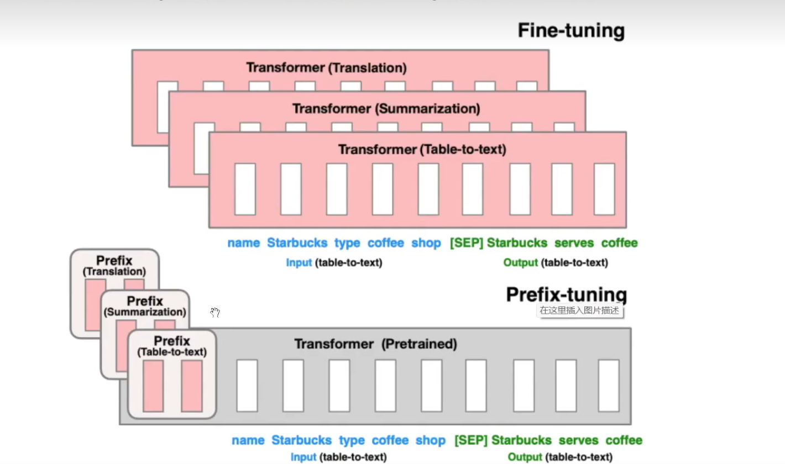
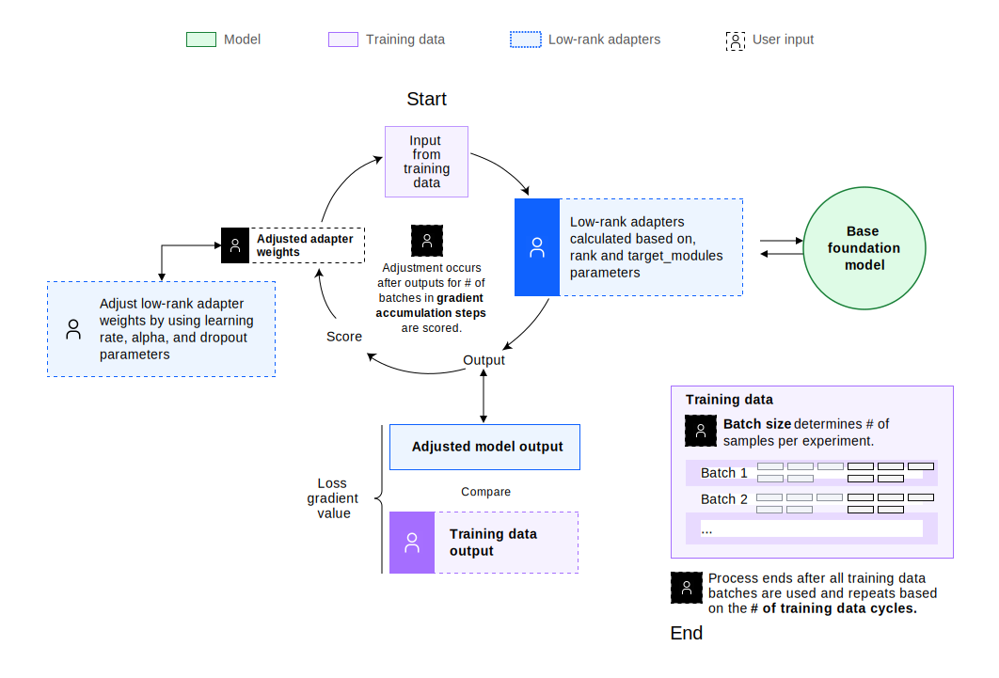
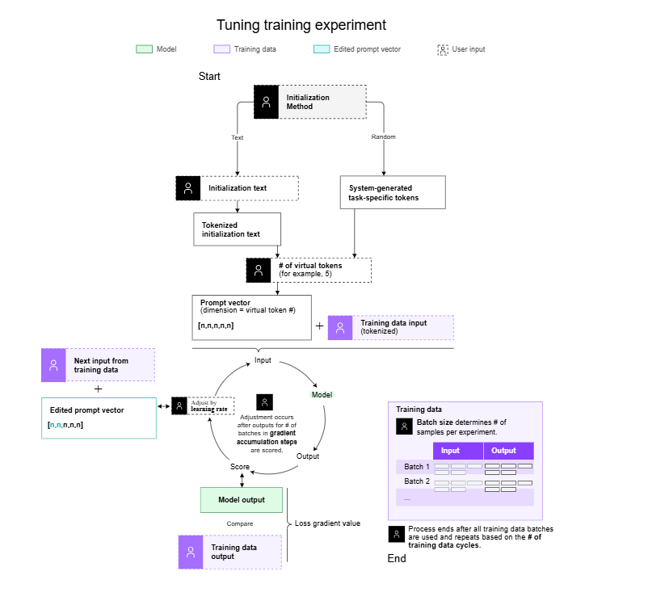

# Fine Tuning
## Table Of Contents
- [What is Fine Tuning](#1-what-is-fine-tuning)
    - [Why Fine Tuning Works](#why-fine-tuning-works)
    - [Types of Fine Tuning](#types-of-fine-tuning)
    - [Four Methods for Fine Tuning](#four-methods-for-fine-tuning)
- [Catastrophic Forgetting](#13-catastrophic-forgetting)
    - [Prompt Calibration](#1-prompt-calibration)
    - [Fine Tuning](#2-fine-tuning)
    - [Data Agumentation](#3-data-augmentation)
- [PEFT](#peft)
    - [What is PEFT](#what-is-peft)
- [Adapter Tuning](#16-adapter-tuning)
- [Fine Tuning Methods Overview](#fine-tuning-methods-overview)
    - [Full or Partial Weight Fine-Tuning Classic Methods](#tier-1-full--partial-weight-fine-tuning-classic-methods)
    - [Parameter Efficient Fine-Tuning(PEFT)](#tier-2-parameter-efficient-fine-tuning-peft)
- [Fine Tuning Methods in Details](#fine-tune-methods-in-details)
    - [Freeze Method](#freeze-method)
    - [P-Tuning Method](#p-tuning-method)
        - [What is P-Tuning](#what-is-p-tuning)
        - [Prefix Tuning Workflow](#prefix-tuning-workflow)
            - [Top Half](#1-top-half-fine-tuning-full--partial-model-updates)
            - [Bottom Half](#2-bottom-half-prefix-tuning-parameter-efficient-fine-tuning)
    - [Full Fine Tuning](#full-fine-tuning)
        - [Definition of Full Fine-Tuning](#definition-of-full-fine-tuning)
        - [How Full Fine-Tuning Works](#how-full-fine-tuning-works)
    - [LoRA](#lora)
    - [Prompt Tuning](#prompt-tuning)
        - [What is Prompt Tuning](#what-is-prompt-tuning)
        - [What does Adjusting the Prompt Actually Mean](#what-does-adjusting-the-prompt-actually-mean)
        - [Why Prompt Tuning Works(Intuition)](#why-prompt-tuning-works-intuition)

## 1. What Is Fine-Tuning?
- **Fine-tuning** is the process of taking a **pre-trained** language model (like GPT, BERT, or T5) and training it further on a **smaller**, **domain-specific** dataset to make it perform better on a **specific task or language style**.
- A pre-trained model has already learned:
    - grammar, syntax, and general world knowledge
    - context relationships between words and phrases
    - reasoning patterns and text structure
- However, it doesn’t yet “know” how to handle **specialized tasks**, like:
    - classifying sentiment (e.g., positive/negative reviews),
    - generating medical summaries,
    - extracting entities from legal documents,
    - or answering customer queries in a specific tone.
- Fine-tuning adapts this general knowledge to **task-specific objectives**.

## 2. Why Fine-Tuning Works
- When a model like DistilBERT is pre-trained:
    - It learns general knowledge of language patterns.
    - But it doesn’t know how to perform **task-specific** jobs like classifying IMDb reviews as positive or negative.


## 3. Fine-Tuning Workflow
1. **Start from a pre-trained base model (e.g., `bert-base-uncased`, `gpt-3.5-turbo`).**
2. **Prepare your dataset:**
- Input–output pairs, labeled text, or conversation data.
- Split into train/validation sets.
3. Choose the fine-tuning method:
- Full fine-tuning, PEFT, or instruction tuning.
4. **Train the model:**
- Define hyperparameters (learning rate, epochs, batch size).
- Use frameworks like Hugging Face Transformers or OpenAI Fine-tuning API.
5. Evaluate:
- Metrics: accuracy, F1 score, BLEU, or perplexity (depending on the task).

## Four Methods for Fine-Tuning
### Prompt Tuning (a.k.a Soft Prompting / P-Tuning / Prefix Tuning)
- **Definition**:
    - Prompt tuning does not modify the model weights at all.
    - Instead, it learns a small set of trainable prompt embeddings that are prepended to the input.
### Full Fine-Tuning (Standard Fine-Tuning)
- **Defintion**:
    - You update all the parameters of the model.
    - This is the original and most powerful form of fine-tuning.
- **How It Works**:
    - Unfreeze all layers.
    - Train on your custom dataset.
    - Every weight is updated via backpropagation.
- **Characteristics**

| **Property**       | **Value**                            |
| ------------------ | ------------------------------------ |
| Parameters trained | 100%                                 |
| Cost               | extremely expensive                  |
| Memory             | very high (needs multiple GPUs)      |
| Quality            | best performance possible            |
| Best for           | large datasets, domain-specific LLMs |

## PEFT
### What is PEFT?
- **Parameter-Efficient Fine-Tuning (PEFT)** adapts a frozen pretrained model by training only a small set of extra parameters (or a tiny subset of existing ones). The backbone weights stay fixed, so you keep the general knowledge while learning a new task/domain cheaply.
### Major PEFT families (how they plug in)


#### **LoRA (Low-Rank Adapters)**
Learn two small matrices \( A \in \mathbb{R}^{d \times r} \), \( B \in \mathbb{R}^{r \times d} \) and add their product to a frozen weight \( W \):

\[
W' = W + \alpha \cdot A B
\]

Usually applied to attention projections (**q/v**).  
Only \( A, B \) train (rank \( r \ll d \)).

---

#### **Adapters (Bottleneck Blocks)**
Insert a tiny MLP after (or inside) Transformer sublayers:

\[
h \mapsto h + W_\text{up} \, \sigma(W_\text{down} \, \text{LN}(h))
\]

Initialize near identity so the model starts as the base model; only adapter weights train.

---

#### **Prefix / Prompt / P-Tuning**
Learn a small set of **virtual tokens** (or key/value *prefixes*) prepended per layer or sequence — only these embeddings are trainable.

---

#### **IA³ / Gating / BitFit**
Learn per-channel scaling vectors (**IA³**) or just biases (**BitFit**).  
Extremely small parameter count.
### Why PEFT prevents catastrophic forgetting
- **Catastrophic forgetting** happens when you update the shared backbone and overwrite features needed for older tasks. PEFT avoids that by design:
    - **Parameter isolation**:
        - The backbone is frozen. New knowledge lives in the tiny trainable pieces (LoRA `𝐴`,`𝐵`, adapter layers, prefixes). Old capabilities aren’t overwritten because their weights never change.
    - **Identity initialization**:
        - Adapters/LoRA start as (near) identity/zero-update, so training nudges behavior locally instead of globally rewriting representations.
    - **Low-rank / low-capacity updates**
        - Constraining updates (e.g., low rank 𝑟) regularizes changes; you can’t drastically deform the function even if you try.
    - **Task modularity**:
        - You can **keep one adapter per task**. Switching tasks is swapping small modules—no retraining, no interference. (If you fine-tune Task B, Task A’s adapter is untouched.)
    - **Reversibility**:
        - With LoRA you can “merge” or simply **detach** the adapters; the original backbone remains intact on disk.
### When PEFT might not be enough
- Huge domain shift or very complex tasks → increase LoRA rank / adapter width, or fall back to partial/full fine-tuning.
- If you keep updating the **same** adapter sequentially across tasks, you can still forget—use separate adapters or multi-task training.

## Fine-Tuning Methods Overview
### Tier 1: Full & Partial Weight Fine-Tuning (Classic Methods)
#### 1. Full Fine-Tuning
- Updates **100% of model weights**
- Highest cost and memory usage
- Best when:
    - You have large datasets
    - You control the model weights
- **Pros**
    - Maximum flexibility
    - Strong domain adaptation
- **Cons**
    - Very expensive
    - Risk of overfitting
    - One model per task

#### 2. Layer Freezing / Partial Fine-Tuning
- **(Train only some layers)**
    - Freeze lower layers
    - Train top layers only
- **Pros**
    - Cheaper than full fine-tuning
    - Retains general language ability
- **Cons**
    - Limited adaptability
    - Rarely used for modern LLMs
### Tier 2: Parameter-Efficient Fine-Tuning (PEFT)
#### 3. LoRA (Low-Rank Adaptation)
- Injects low-rank adapter matrices
- Freezes base model
- Trains ~0.1–2% of parameters
##### Pros
- Very efficient
- Widely adopted
- Multiple tasks = multiple adapters
##### Cons
- Slightly less expressive than full FT
#### 4. QLoRA (Quantized LoRA)
- Base model in **4-bit**
- Adapters in FP16
##### Pros
- Enables fine-tuning 7B–70B models on a single GPU
- Extremely memory efficient
##### Cons
- Slightly slower training
- More complex setup
#### 5. Adapter Tuning (Houlsby / Pfeiffer Adapters)
- Inserts small neural modules between layers
- Older than LoRA

### Tier 3: Prompt-Level & Output-Level Tuning
#### 6. Prompt Tuning / Prefix Tuning
- Learns **soft prompts** (trainable embeddings)
- Model weights frozen
##### Pros
- Extremely lightweight
- Fast training
##### Cons
- Limited capability
- Sensitive to task complexity

#### 7. Instruction Tuning (Supervised Fine-Tuning, SFT)
- Teaches the model how to follow instructions
- Can be:
    - Full fine-tuning
    - LoRA-based
    - API-based (e.g., OpenAI)

## Fine-Tune Methods in Details
### Freeze Method
- The Freeze method literally means freezing parameters.
- In this approach, most of the parameters of the original large model are frozen, and only a small subset of parameters is trained.
- By doing so, memory usage can be significantly reduced, making it possible to fine-tune large models more efficiently.

### P-tuning Method
#### What is P-tuning
- P-tuning is a parameter-efficient fine-tuning (PEFT) method that teaches a language model how to prompt itself.
- Instead of:
    - manually writing text prompts like
        - “Please classify the sentiment of the following sentence…”
    - P-tuning:
        - **learns continuous prompt embeddings automatically**
        - keeps the **entire pretrained model frozen**
        - optimizes only a **small number of prompt parameters**

#### Prefix-Tuning Workflow

##### 1. Top Half: Fine-tuning (Full / Partial Model Updates)
- **What the diagram shows**
    - You see multiple Transformer stacks, each labeled with a task:
        - **Translation**
        - **Summarization**
        - **Table-to-text**
    - Each task has its **own adapted Transformer**.
- What is happening conceptually
1. **Start from a pre-trained Transformer**
- The model already knows general language patterns.
2. **Duplicate the model for each task**
- One copy fine-tuned for translation
- Another for summarization
- Another for table-to-text
3. **Update (train) model parameters**
- **All parameters** (full fine-tuning), or
- **Some layers** (freeze-based fine-tuning)
##### 2. Bottom Half: Prefix-tuning (Parameter-Efficient Fine-Tuning)
- **What the diagram shows**
    - A **single frozen pre-trained Transformer** (gray block).
    - Small **task-specific “prefix” blocks**:
        - Prefix (Translation)
        - Prefix (Summarization)
        - Prefix (Table-to-text)

### Full Fine-tuning
#### Definition of Full Fine-tuning
- Full fine-tuning is a training method where all parameters of a pre-trained foundation model are updated using a **smaller**, **task-specific dataset**.
- Instead of freezing layers or adding adapter modules (like in LoRA or QLoRA), full fine-tuning **modifies every weight** of the base model.

#### How Full Fine-Tuning Works
##### 1. Prepare Training Data
- You provide a dataset of **input** → **target** output pairs, such as:
    ```vbnet
        Input: "Summarize this text..."
        Output: "This article explains..."
    ```
- These examples define how you want the model to behave.
##### 2. Feed Each Batch Into the Model
- The training data is split into batches (e.g., 32 or 64 samples per batch).
- 

#### Full Fine-Tuning Workflow Explained (Step-by-Step)

##### 1. **Training Data (Step 1)**
- **Training data is divided into batches**
    - Training datasets are large.
    - Instead of feeding the entire dataset at once, we split it into **batches** (Batch 1, Batch 2, …).
- **Why batches?**
    - Reduce memory usage
    - More stable optimization
    - Support gradient accumulation
##### 2. **Start: Input a batch into the model (Step 2)**
- Each batch is passed into the model:
```nginx
Batch → Model → Output
```
- This produces predictions (logits or probabilities).
- The model still uses **old parameters** at this stage.
##### 3. Compare model output vs. expected output → Compute Loss (Step 3)
- Compare:
    - **Model output** (predicted result)
    - **Training data output** (true labels)
- Loss function
##### 4. Update Model Weights (Step 4)
- **Optimizer updates all model weights**
    - Since this is full fine-tuning, every parameter in every layer is updated.
    - Common optimizers:
        - AdamW
        - SGD
        - RMSProp
- **Controlled by learning rate**
    - The diagram shows:
        - Adjust by learning rate
    - Learning rate controls the size of each update step.
    - Too high → unstable training
    - Too low → slow training
- **Gradient accumulation**
- **Model ready for next iteration (Step 5)**
    - 

### LoRA
#### What is Low-Rank Adaptation (LoRA)?

- **Low-Rank Adaptation (LoRA)** is a **parameter-efficient fine-tuning (PEFT)** technique designed to adapt large pre-trained models for specific tasks **without significantly increasing computational or memory costs**.

- As large language models (LLMs) grow in size and complexity, fine-tuning them on new tasks often requires **substantial computational power and GPU memory**.  
- LoRA solves this problem by reducing the number of trainable parameters — making the fine-tuning process **faster, lighter, and more efficient**.

---

#### 🧠 Key Idea

LoRA modifies the standard fine-tuning process by **inserting small trainable low-rank matrices** into specific layers (typically the attention projections) of a frozen pre-trained model.  
Instead of updating the full parameter matrix \( W \), LoRA decomposes it into two smaller matrices \( A \) and \( B \):

\[
W' = W + A \cdot B
\]

- \( W \): Original frozen weight matrix  
- \( A \): Low-rank matrix of size \( d \times r \)  
- \( B \): Low-rank matrix of size \( r \times d \)  
- \( r \): Rank (typically much smaller than \( d \))

Only \( A \) and \( B \) are trained, while \( W \) remains frozen — significantly reducing computational overhead.

---

#### ⚙️ Architecture of LoRA

- LoRA is typically integrated into **Transformer-based models** (like GPT, BERT, or T5).  
- Here’s how it works step by step:

1. **Pre-Trained Backbone**  
   - Begin with a large transformer model that has already been trained on massive general-purpose data.

2. **Low-Rank Adaptation Layers**  
   - Insert small, trainable low-rank matrices \( A \) and \( B \) into specific attention projection layers (e.g., query or value matrices).  
   - These are the *only* parameters that get updated during fine-tuning.

3. **Frozen Original Parameters**  
   - The original model weights remain **frozen**.  
   - This ensures that general language knowledge is preserved and prevents **catastrophic forgetting**.

4. **Task-Specific Fine-Tuning**  
   - Fine-tune only the low-rank matrices for a specific task (like sentiment analysis or translation).  
   - The model learns the new task efficiently while maintaining previous capabilities.

#### Explanation of How LORA Works

##### 1. Training Data & Batching (Right side, purple box)
- **Training data**
    - The dataset is split into batches (Batch 1, Batch 2, …).
    - **Batch size** determines how many samples are processed per step.
    - Multiple batches = one epoch.
    - Multiple epochs = full training.
##### 2. Input from Training Data (Top center)
- Each batch provides:
    - **Input text** (e.g. prompt, question)
    - **Expected output** (ground truth)
- This input flows into the model through **the LoRA adapters**, not directly into trainable base weights.
##### 3. Base Foundation Model (Green circle, right)
###### **Frozen model**
- This is the original pre-trained model (GPT, LLaMA, Mistral, etc.).
- All original weights are frozen:
    - Attention layers
    - Feed-forward layers
    - Embeddings
- Unlike full fine-tuning, **no gradients update these weights**.
##### 4. Low-Rank Adapters (Blue dashed box, center-right)
- This is the core of LoRA
- LoRA inserts **small trainable matrices** into specific layers:
    - Usually **Q, K, V** projections in attention
- These adapters are defined by:
    - **Rank (r)** → how expressive the adapter is
    - **Target modules** → which layers get adapters
- Mathematically:
$$W_{\text{effective}} = W_{\text{base}} + \Delta W$$
$$\Delta W = B \cdot A \quad (r \ll d)$$
- Only A and B are trainable.

##### 5. Forward Pass → Adjusted Model Output (Bottom center)
```css
Input → Base Model (frozen)
      → LoRA adapters applied
      → Adjusted model output

```

- The output looks like a fully fine-tuned model, but:
    - The base weights are unchanged
    - The adapters steer the behavior
##### 6. Compare with Training Data Output (Purple dashed box)
- The model output is compared with the **ground-truth output**.
- A **loss function** (e.g. cross-entropy) is computed.

##### 7. Backpropagation (Only into adapters)
- **This is the biggest difference vs full fine-tuning**
- Gradients **flow only into LoRA adapters**
- The base model **does not receive gradients**
- This drastically reduces:
    - Memory usage
    - Training time
    - Overfitting risk


### Prompt Tuning
#### What Is Prompt Tuning?
- **Prompt tuning** is a lightweight model adaptation technique where **you do NOT change the model’s weights at all**.
- Instead, you **modify the input prompt** in a systematic way so that the model’s output aligns with a desired task, style, or behavior.
#### What Does “Adjusting the Prompt” Actually Mean?
##### 1. Manual Prompt Engineering (Basic Prompt Tuning)
- **Example**
```text
You are a professional medical assistant.
Answer the following question clearly and concisely.

Question: What are the symptoms of anemia?

```
##### 2. Few-Shot Prompt Tuning (In-Context Learning)
- **Example**
```text
Q: What causes headaches?
A: Stress, dehydration, lack of sleep.

Q: What causes chest pain?
A: Heart problems, muscle strain, acid reflux.

Q: What causes anemia?
A:

```
##### 3. Soft Prompt Tuning (Learned Prompt Embeddings)
- This is where prompt tuning becomes **trainable**, but still **does not update the model itself**.
- Instead of text tokens, you train a small set of **continuous vectors** (called soft prompts) that are prepended to the input embeddings.
```arduino
[ p1 p2 p3 p4 ] + "What are symptoms of anemia?"

```
- `p1…p4` are **learned vectors**
- The base LLM is **frozen**
- Only these vectors are updated during training

#### Why Prompt Tuning Works (Intuition)
- Large Language Models already contain:
    - Grammar
    - World knowledge
    - Reasoning patterns
    - Task representations
- Prompt tuning **selects and activates** the right behavior **without rewriting knowledge**.
#### How prompt tuning works
##### 1. Why prompt tuning exists (problem motivation)
- **Sensitivity to input**
    - Foundation models are **extremely sensitive to how input is phrased**.
    - Even small wording changes can alter:
        - reasoning depth
        - format
        - factual accuracy
        - verbosity
- **Limitations of manual prompt engineering**
- 

##### 2. Key idea: prompts don’t have to be words
- **Traditional prompting**
    - Normally, prompts are:
    ```css
    Text → Tokens → Token IDs → Embeddings

    ```
    - Example:
    ```css
    "What is anemia?"
    → ["What", "is", "anemia", "?"]
    → [1096, 318, 3291, 30]
    → embedding vectors

    ```
##### 3. What is a “prompt vector”?
- A **prompt vector** is:
    - A sequence of trainable embedding vectors
    - Same dimensionality as token embeddings
    - Prepended to the input embeddings
- Conceptually:
```scss
[p1, p2, p3, p4] + Embeddings("What is anemia?")

```
- Important:
    - `p1…p4` are **not words**
    - They never pass through the tokenizer
    - They are learned via gradient descent

#### Diagram of Prompt Tuning

##### 1. Start → Initialization Method (Top of Diagram)
- **“Initialization Method” box**
    - This is where the system decides **how to initialize the prompt vector**.
- You have **two choices**:
    - **Option A: Text-based initialization (Left branch)**
        - **Flow**:
        ```arduino
        Initialization text
        → Tokenized initialization text
        → Prompt vector

        ```
        - **What this means**:
            - You provide human-written text (e.g. “Answer medical questions concisely”)
            - The text is tokenized
            - Tokens are converted to embeddings
            - These embeddings become the **initial prompt vector**
##### 2. Number of Virtual Tokens
- **“# of virtual tokens (for example, 5)”**
    - This controls the **length of the prompt vector**.
        - Virtual tokens = **soft tokens**
        - They do NOT correspond to real words
        - Each token = one embedding vector
    - 
##### 3. Prompt Vector Construction
- **“Prompt vector (dimension = virtual token #)”**
- This is the **core trainable object**.
##### 4. Concatenation With Training Input
##### 5. Forward Pass Through the Model
- **“Model” (green box)**
