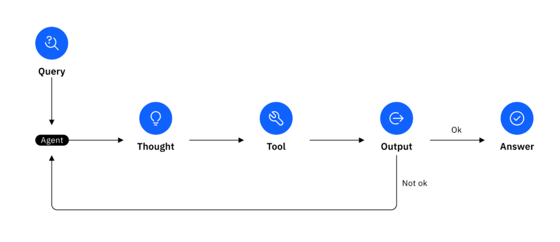
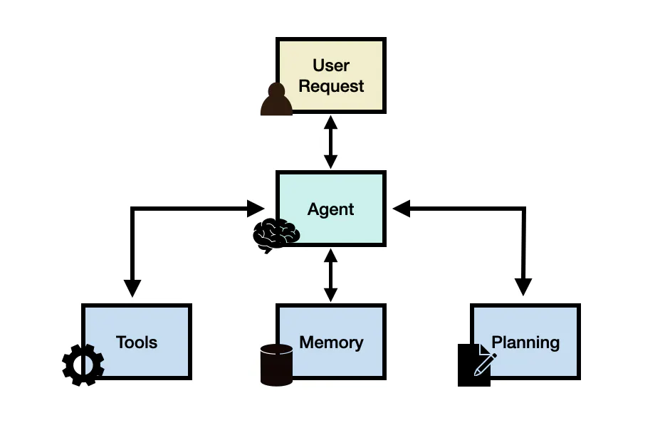

# LLM DEMO
## Table Of Contents
- [What is LLM](#1-what-is-llm)
    - [Definition of LLM](#definition-of-llm)
    - [Key Components of LLM](#key-components-of-llm)
- [Basic Concepts](#2-basic-concepts)
    - [Token](#21-token)
    - [Parameters](#22-parameters)
    - [Embeddings](#23-embeddings)
    - [Transformer Architecture](#24-transformer-architecture)
    - [Fine Tuning](#25-fine-tuning)
    - [Perplexity](#26-perplexity)
    - [Accuracy](#27-accuracy)
    - [F1 Score](#28-f1-score)
    - [Recall](#29-recall)
    - [BlEU(Bilingual Evaluation Understudy)](#210-bleu-bilingual-evaluation-understudy)
    - [Rouge](#211-rouge)
    - [Prompt](#212-prompt)
    - [Hyperparameters](#213-hyperparameters)
    - [Context Window](#214-context-window)
- [Common pre-training objectives for LLM](#3-what-are-some-common-pre-training-objectives-for-llms-and-how-do-they-work)
- [How do you Measure the Performance of an LLM](#4-how-do-you-measure-the-performance-of-an-llm)
    - [Perplexity](#41--perplexity)
    - [Accuray](#42--accuracy)
    - [F1 Score](#43-f1-score)
    - [BLUE](#44-bleu-bilingual-evaluation-understudy-score)
    - [ROUGE](#45-rouge-recall-oriented-understudy-for-gisting-evaluation)
- [Techiques for controlling the out of an LLM](#5-techniques-for-controlling-the-output-of-an-llm)
- [Hyperparameters](#6-hyperparameters)
- [How can you incorporate external knowledge into an LLM](#7-how-can-you-incorporate-external-knowledge-into-an-llm)
    - [Knowledge Graph](#71-knowledge-graph-integration)
    - [RAG](#72-rag)
    - [Fine Tuning](#73-fine-tuning-with-domain-specific-data)
    - [Prompt Engineering](#74-prompt-engineering)
- [Comparison Between RAG and Fine-tuning](#7extra-comparison-between-rag-and-fine-tuning)
- [Agentic RAG](#8-agentic-rag)
    - [What is Agentic RAG](#what-is-agentic-rag)
    - [How does Agentic RAG Work](#how-does-agentic-rag-work)
    - [Comparison between Agentic RAG and Traditional RAG](#comparison-between-agentic-rag-and-traditional-rag)
- [Planner](#9extra-planner)
- [Three famous GraphRAG frameworks](#9-three-famous-graphrag-framekworks)
- [Semantic Gap in RAG](#10-semantic-gap-in-rag)
- [How can bias in prompt-based learning be mitigated?](#11-how-can-bias-in-prompt-based-learning-be-mitigated)
- [Fine Tuning](#12-fine-tuning)
- [Fine Tuning](#12-fine-tuning)
    - [What is Fine Tuning](#what-is-fine-tuning)
    - [Why Fine Tuning Works](#why-fine-tuning-works)
    - [Types of Fine Tuning](#types-of-fine-tuning)
    - [Four Methods for Fine Tuning](#four-methods-for-fine-tuning)
- [Catastrophic Forgetting](#13-catastrophic-forgetting)
    - [Prompt Calibration](#1-prompt-calibration)
    - [Fine Tuning](#2-fine-tuning)
    - [Data Agumentation](#3-data-augmentation)
- [LoRA](#14preknowledge-lora)
- [PEFT](#14-peft)
- [Adapter Tuning](#16-adapter-tuning)
- [Hallucination](#17-hallucinations)
- [Knowledge Distillation](#18-knowledge-distillation)
- [Model Uncertainty](#19-model-uncertainty)
- [Prompt Engineering](#20-prompt-engineering)
- [What are some approaches to reduce the computational cost of LLMs?](#21-what-are-some-approaches-to-reduce-the-computational-cost-of-llms)
- [What is the purpose of quantization in training large language models?](#)
- [Quantitative metrics and Qualitative Evaluation](#22-quantitative-metrics-and-qualitative-evaluation)
    - [Quantitative Metrics](#quantitative-metrics)
        - [Common Quantitative Metrics](#common-quantitative-metrics)
    - [Qualitative Evaluation](#qualitative-evaluation)
- [React Agent](#23-react-agent)
    - [React Prompting](#react-prompting)
- [Vector Store Use Case](#24-vector-store-use-case)
- [FLOP](#25pre-flop)
- [MOE](#25-moe)
    - [What is Mixture of Experts(MOE)](#what-is-mixture-of-experts-moe)
    - [Core Idea of MOE](#core-idea-of-moe)
    - [How MOE Works](#how-moe-works)
- [Different AI Frameworks](#26-different-ai-frameworks)
    - [The Crossrods of AI Application Development](#the-crossroads-of-ai-application-development)
    - [Langchain](#langchain-the-king-of-deep-customization)
- [Setup](#setup)

## 1. What is LLM
### Definition of LLM
- A Large Language Model is a **deep neural network**, typically based on the Transformer architecture, trained on billions or trillions of words from books, websites, code, and other sources to predict the next word (token) in a sequence.
- Built on the **Transformer architecture**, LLMs are trained on massive text datasets to learn patterns in grammar, semantics, logic, and world knowledge.
- It is **“large”** because:
    - It has **billions of parameters** (learned weights),
    - It is trained on **massive datasets**, and
    - It requires **high computational power** to train.
### Key Components of LLM
1. **Model Architecture (Transformer)**
- The **Transformer** is the foundation of all modern LLMs.
- It consists of repeating layers of:
    - **Self-Attention Mechanism** – lets the model focus on relevant words in context.
    - **Feedforward Neural Network** – processes and transforms embeddings.
    - **Normalization & Residual Connections** – stabilize training and preserve gradients.
2. **Tokenization Layer**
- Before text enters the model, it’s converted into tokens:
    - Uses **Byte Pair Encoding (BPE)** or **SentencePiece**.
    - Converts words/subwords into **numerical IDs**.
    - Enables models to process arbitrary text efficiently.
3. **Embedding Layer**
- Transforms token IDs into **dense vectors** (numerical representations).
- These embeddings encode:
    - **Semantic meaning** of words.
    - **Positional information** (so the model knows word order).
4. **Positional Encoding**
- Since Transformers don’t inherently know sequence order, **positional encodings** add this information.
    - Each token’s embedding is adjusted based on its position in the sentence.
    - Can be **sinusoidal** (static) or **learned** (trainable).
5. **Training Objectives**
- LLMs learn via pre-training on massive text corpora:
    - **Autoregressive (AR)** — predict the next token (used in GPT).
    - **Masked Language Modeling (MLM)** — predict masked tokens (used in BERT).
    - **Sequence-to-sequence** — predict target sequence from input (used in T5).
    
## 2. Basic Concepts
### 2.1 Token
- **Definition**: A token is the smallest unit of text the model processes — usually a word, subword, or symbol.
- **For Example**:
    - “I love cats” → `[I] [love] [cats]` (word-level tokenization)
    - “unbelievable” → `[un] [believ] [able]` (subword tokenization)
- **Why it matters**:
    - The model’s input and output lengths are measured in tokens, not characters or words.
    - LLM pricing, context length, and speed all depend on token count.
### 2.2 Parameters
- **Definition**: The parameters are the weights inside the neural network that the model learns during training.
They define how the model transforms input tokens into contextual representations.
- **Example**:
    - GPT-3 → 175 billion parameters
    - BERT → 340 million parameters
    - More parameters → greater capacity to model complex relationships.
### 2.3 Embeddings
- **Definition**: 
    - **Embeddings** are high-dimensional vector representations of words, sentences, or documents that capture **semantic meaning**.
    - Words with similar meanings (e.g., “happy” and “joyful”) are close together in embedding space.
- **Used for**:
    - Semantic search
    - Text similarity
    - Retrieval-Augmented Generation (RAG)

### 2.4 Transformer Architecture
- **Definition**:
    - The **Transformer** is the backbone of modern LLMs. It uses self-attention to model relationships between all tokens in a sequence simultaneously.
- **Key Components**:
    - **Encoder**: Reads and understands context (used in BERT, T5).
    - **Decoder**: Generates text autoregressively (used in GPT).
    - **Encoder-Decoder**: Both read and generate (used in T5, BART).
### 2.5 Fine-Tuning
- **Definition**:
    - Fine-tuning is the process of **adapting a pre-trained model** (e.g., GPT or BERT) to a specific domain or task by continuing its training on a smaller, focused dataset.
- **Purpose**:
    - Improves model performance for specific goals like sentiment analysis, summarization, or domain adaptation (e.g., legal or medical texts).
### 2.6 Perplexity
- **Definition**:
    - Perplexity measures **how well a language model predicts text**.
    - It’s the exponential of the average negative log-likelihood of the predicted tokens.
- **Formula**:
    - Perplexity=e^Loss
- **Interpretation**:
    - Low perplexity → confident and accurate predictions.
    - High perplexity → model is “surprised” by the actual text.
### 2.7 Accuracy
- **Definition**:
    - The proportion of correct predictions out of all predictions.
    - Often used in classification tasks (e.g., sentiment analysis).
- **Formula**:

### 2.8 F1 Score
- **Definition**:
    - Combines **precision** and **recall** into a single metric for evaluating classification performance.
    - Useful when data is imbalanced.
- **Formula**:
    - F1=2×(Precision*Recall)/(Precision+Recall)
    - ​
### 2.9 Recall
- **Definition**:
    - Recall measures how well the model identifies all relevant instances from the data.
    - It’s the proportion of actual positives that the model correctly predicts as positive.
- **Formula**:
    - Recall=(True Positives + False Negatives)/True Positives​
- 
### 2.10 BLEU (Bilingual Evaluation Understudy)
- **Definition**:
    - BLEU is a **text generation quality metric**, originally for machine translation.
    - It measures **n-gram overlap** between model-generated text and reference text.
- **Interpretation**:
    - BLEU = 1 (or 100) → perfect match with reference.
    - BLEU ≈ 0 → little to no overlap.
- **Used for**:
    - Translation, summarization, dialogue systems.
- **Diagram of BLEU**:
- 

### 2.11 ROUGE
- **Definition**:
    - ROUGE (Recall-Oriented Understudy for Gisting Evaluation) evaluates **how much of the reference text is captured** in the generated text.
- **Types**:
    - ROUGE-1 → unigram overlap
    - ROUGE-2 → bigram overlap
    - ROUGE-L → longest common subsequence
- **Used for**:
    - Summarization and paraphrasing evaluation.
### 2.12 Prompt
- **Definition**:
    - A **prompt** is the input text or instruction given to the LLM to guide its output.
    - The quality and structure of the prompt significantly affect model performance.
- **Example**:
    - “Explain quantum computing in simple terms.”
    - “Translate this to French: Hello, how are you?”
### 2.13 Hyperparameters
- **Definition**:
    - These are **tunable settings** that control how a model learns or generates text.
    - They are not learned from data but set manually before training or inference.
    - **Examples**:
        - Learning rate
        - Batch size
        - Temperature
        - Top-k / Top-p sampling
        - Max tokens
### 2.14 Context Window
- **Defintion**:
    - The **maximum number of tokens** a model can process at once.
    - Determines how much prior conversation or text the model can “remember.”
- **Example**:
    - GPT-3: 4K tokens
    - GPT-4-turbo: 128K tokens
    - Claude 3: up to 200K tokens
### 2.15 Embedding Space & Similarity

## 3. What are some common pre-training objectives for LLMs, and how do they work?
### 3.1  Masked Language Modeling (MLM)
- **Used in models like**: BERT, RoBERTa
- **How it works**:
    - Random tokens in a sentence are masked (replaced with `[MASK]`).
    - The model is trained to predict the masked word using both left and right context (i.e., it's **bidirectional**).
### 3.2 Autoregressive Language Modeling (AR)
- **Used in models like**: GPT, GPT-2, GPT-3, GPT-4


## 4. How do you measure the performance of an LLM?
### 4.1 🔢 Perplexity
- **definition**:
Perplexity is a measurement of how well a language model predicts a sequence. It is the exponential of the average negative log-likelihood of the predicted tokens.
- **formula**:
Perplexity = *e*^Loss
- **interpretation**:
    **Low perplexity** → Model is confident and accurate in predicting the next tokens.
    **High perplexity** → Model is "surprised" by the actual tokens.
- **Use Case**:
    - Commonly used for **language modeling** and **text generation** tasks.

### 4.2 🧮 Accuracy
- **definition**:
Accuracy is the ratio of **correct predictions to total predictions**. It is commonly used in classification tasks (e.g., sentiment analysis, text classification).
- **formula**:
Accuracy = Number of Correct Predictions / Total Predictions
- **Interpretation**:
    - A higher accuracy value indicates better performance, though it can be misleading on **imbalanced datasets** (where some labels dominate).
### 4.3 F1 Score
- **definition**:
F1 Score is the **harmonic mean** of Precision and Recall. It is especially useful for imbalanced datasets.

- **Precision** = How many of the predicted positives are correct?

- **Recall** = How many of the actual positives did the model catch?

- **formula**:
F1=(2*Precision*Recall)/(Precision+Recall)

### 4.4 BLEU (Bilingual Evaluation Understudy) Score
#### **Definition**:
- BLEU measures how close the model-generated text is to one or more **reference translations**.
- It evaluates **machine translation** and **text generation** quality by comparing overlapping **n-grams** (word sequences).

#### **How it works**:
1. Split sentences into n-grams (e.g., unigrams, bigrams, trigrams).
2. Count overlapping n-grams between generated and reference text.
3. Apply a **brevity penalty** to prevent favoring overly short outputs.

#### **Interpretation**:
- **BLEU = 1 (100%)** → Perfect match.
- **Higher BLEU** = better translation fluency and adequacy.

#### Use Case:
- Commonly used in **machine translation**, **text summarization**, and **paraphrasing models**.

### 4.5 ROUGE (Recall-Oriented Understudy for Gisting Evaluation)
- **Definition**
    - ROUGE measures the overlap between **generated text** and **reference text**.
    - It’s primarily used for **summarization** and **text generation** tasks.
- **Variants**:
    - **ROUGE-N**: n-gram overlap (e.g., ROUGE-1 = unigram, ROUGE-2 = bigram).
    - **ROUGE-L**: Longest Common Subsequence (LCS)-based overlap.
    - **ROUGE-S**: Skip-bigram co-occurrence.
- **Formula (simplified)**:
    - ROUGE-N=Overlapping N-grams​/Total N-grams in Reference
- **Interpretation**
    - High **ROUGE recall** = generated text covers key reference content.
    - High **ROUGE precision** = concise and relevant summary.
- **Use Case**:
    - Evaluates **automatic summarization**, **headline generation**, and **answer synthesis**.

### Summary Table

| **Metric**     | **Purpose**                            | **Best For**            | Desired Value |
| -------------- | -------------------------------------- | ----------------------- | ------------- |
| **Perplexity** | Predictive uncertainty                 | Language modeling       | Lower         |
| **Accuracy**   | Overall correctness                    | Classification          | Higher        |
| **F1 Score**   | Balance between precision & recall     | NER, sentiment, QA      | Higher        |
| **BLEU**       | Quality of generated vs reference text | Translation, generation | Higher        |
| **ROUGE**      | Overlap with human summaries           | Summarization           | Higher        |

## 5. Techniques for Controlling the Output of an LLM
These methods let developers influence how a model responds, balancing between randomness, relevance, creativity, and determinism.
### 5.1 🔥 Temperature
#### **What it does:** 
Controls the level of randomness in token selection.
#### How it works:
During generation, the model uses probabilities to decide the next token. Temperature scales these probabilities:
- A **lower value** (e.g., 0.2) sharpens the distribution — the model is more confident and **chooses the most likely next word**, producing **deterministic and repetitive** outputs.
- A **higher value** (e.g., 1.0 or 1.5) flattens the distribution, allowing for more **diverse, creative, and unpredictable** text.

#### 🧊 Low Temperature (temperature=0.2)
- Explanation:
    - The output is **coherent**, **rhythmic**, and **safe**.
    - GPT-4 chooses tokens with the highest probability, so it sticks to standard poetic themes.
    - Less creative surprises, but more syntactically correct and “professional” sounding.

- ✅ Ideal for:
    - Factual tasks
    - Formal documentation
    - Summarization
    
#### High Temperature (temperature=1.0)
- Explanation:
    - The output is **more imaginative and colorful**.
    - Words like "Emerald galaxies", "ink-black canvas" indicate a **creative leap**.

### 5.2 🎯 Top-K Sampling
- **What it does**: Restricts the token selection pool to the **top K most probable tokens** at each generation step.
- **How it works**: If `top_k=50`, the model only chooses from the top 50 most likely next tokens rather than considering all options.


### 5.3 Top-p Sampling
#### 🔍 What Is Top-P Sampling?
Top-P sampling chooses from the smallest set of tokens whose cumulative probability exceeds the threshold p. Lower values restrict choice to high-confidence tokens; higher values allow more diverse token selection.

#### Explanation in Example
- 0.3:
    - **Summary**: Output is short and nearly identical to 0.6; it stops mid-sentence.
    - **Behavior**: Most focused — selects tokens only from the top ~30% cumulative probability mass. Tends to be **highly relevant but less diverse**.
- 0.6:
    - **Summary**: Nearly identical to 0.3.
    - **Behavior**: Balanced — more flexible than 0.3 but still somewhat focused, but still constrained to safe outputs.
- 0.8 
    - **Summary**: Output starts to diversify — adds some background explanation.

## 6. Hyperparameters
### What are LLM Parameters?
- **Parameters** are the internal values of a model that are **learned automatically during training**.
- They define how the model interprets input and produces output.
- **Examples**
    - **Weights** — the strength of connections between neurons.
    - **Biases** — the offset added to activations before applying non-linear functions.
- In mathematical terms, for a single neuron:
    - y=f(Wx+b)
- where:
    - 𝑊 → weights (parameters)
    - 𝑏 → bias (parameter)
    - f → activation function (e.g., ReLU or GELU)
    - 𝑦 → output of that layer
- 𝑦 → output of that layer
- When you train a large model like GPT, the training algorithm (usually gradient descent) **adjusts millions or billions of these weights and biases** so the model’s predictions match real examples.

### How LLM Parameters Are Learned
- Parameters are updated during training using **backpropagation** and **gradient descent**:
    - The model predicts an output (e.g., next token).
    - The loss function (like cross-entropy) compares prediction vs. ground truth.
    - The optimizer computes **gradients** (how much each parameter contributed to the error).
    - Parameters are updated:
    $$
    \theta_{new} = \theta_{old} - \eta \cdot \nabla_{\theta}L
    $$
    - where:
        - 𝜃 → parameter (weight/bias)
        - 𝜂 → learning rate (hyperparameter)
        - L → loss function
- This process repeats billions of times until the model “learns” patterns in the dataset.

### What are Hyperparameters?
- Hyperparameters are **external configuration settings** that control how the model learns — not what it learns.
- Unlike parameters, **hyperparameters are not learned automatically**.
- They are set manually before or during training and can drastically change the model’s quality, speed, and stability.
- **Examples**
    - **Learning rate** → how big each update step is.
    - **Batch size** → how many samples per update.
    - **Number of layers**, **hidden size**, **number of heads** → define model architecture.
    - **Dropout rate**, **weight decay** → regularization strength.
    - **Temperature**, **top-p**, **top-k** → affect randomness during generation.

### Relationship Between Parameters and Hyperparameters

| **Category**       | **Parameters**                               | **Hyperparameters**                           |
| ------------------ | -------------------------------------------- | --------------------------------------------- |
| **Definition**     | Internal weights/biases learned by the model | External settings chosen by humans            |
| **Examples**       | Layer weights, embedding vectors, biases     | Learning rate, batch size, dropout            |
| **Who sets them?** | Automatically updated by optimizer           | Defined manually by developer                 |
| **Storage**        | Inside model checkpoint                      | In config or training script                  |
| **Effect**         | Determines model knowledge                   | Determines training behavior and output style |

### Dataset Collection
- **dataset** — this is the source of knowledge the model learns from.
- The dataset provides examples (e.g., text, code, conversations).
- The **training algorithm** uses those examples to **adjust parameters**.
- The **hyperparameters** guide how that learning happens — for instance:
    - A **high learning rate** → model learns faster but may become unstable.
    - A **low learning rate** → more stable but slower learning.
    - A **larger batch size** → smoother gradients but more memory usage.

### Three major types of parameters in Large Language Models
#### Weights
- Weights are **trainable parameters** that determine the **strength or importance of each input** when generating outputs.
- In a neural network, every connection between two neurons has an associated **weight value**.
#### Biases
- Biases are **constant values added to the output of a neuron** before applying the activation function.
#### Hyperparameters
- **Definition**
    - Hyperparameters are **external configurations** set by developers **before training**.
#### Categories of Hyperparameters
- **Architecture Hyperparameters**
    - Number of layers (`num_layers`)
    - Hidden dimension size (`hidden_size`)
    - Number of attention heads (`num_heads`)
    - Feedforward dimension (`ffn_dim`)

- **Training Hyperparameters**: Affect how learning progresses
    - **Learning rate** → step size for weight updates
    - **Batch size** → number of samples per gradient update
    - **Dropout rate** → fraction of neurons deactivated to prevent overfitting
    - **Optimizer type** → e.g., AdamW, Adafactor
- **Inference Hyperparameters**:Affect how the model generates text
    - **Temperature** → controls randomness (higher = more creative)
    - **Top-p (nucleus) sampling** → restricts output to top probability mass
    - **Top-k** → restricts output to k most probable tokens
- **Memory and Compute Hyperparameters**
    - **Context window size** → max number of tokens model can “remember”
    - **Precision type (fp16/fp32)** → affects computation speed and accuracy
    - **Gradient accumulation steps** → balance between memory use and batch size
- **Output Quality Hyperparameters**: Used to fine-tune generation style
    - **Repetition penalty** → prevents the model from looping phrases

## 7. How can you incorporate external knowledge into an LLM?
- LLMs (Large Language Models) are trained on vast corpora of text, but their knowledge is static — limited to what they saw during training.
- To make them useful in **real-world**, **dynamic**, or **domain-specific applications**, we can inject external knowledge in several ways:
### 7.1 Knowledge Graph Integration
#### 🧠 What Are Knowledge Graphs?
- A **Knowledge Graph (KG)** is a structured representation of information that uses graph-based data structures to describe how different entities (like people, places, or things) are connected to one another.
- It serves as a **knowledge base** that represents facts in the form of nodes and edges:
    - **Nodes** = entities (e.g., “Paris”, “France”, “Eiffel Tower”)
    - **Edges** = relationships between those entities (e.g., “is located in”, “was built in”)
- For example:
```scss
    (Paris) — [is the capital of] → (France)
    (Eiffel Tower) — [is located in] → (Paris)
```
- This structure makes KGs not just data stores, but **semantic networks** — they understand meaning and relationships, not just raw text.

#### 🔍 Key Features of Knowledge Graphs
1. **Semantic Relationships**
- KGs capture **meaningful connections** between entities, based on **semantics** rather than just keyword matching.
- For instance, a KG understands that “Paris” and “France” are related through the relationship “is capital of,” which is very different from a simple co-occurrence in text.
- This semantic layer enables logical reasoning, contextual search, and better inference by LLMs.

2. **Queryable Structures**
- Knowledge graphs are typically stored in graph databases such as **Neo4j** or **Amazon Neptune**.
- These databases support **graph query languages** such as **SPARQL** (for RDF-based graphs) and **Cypher** (for property graphs).
- Such queries can perform complex reasoning, e.g.:
    - “Find all scientists born in Germany who won a Nobel Prize.”

3. **Scalability for Handling Vast Information**
- KGs can scale to **billions of entities and facts** by integrating data from multiple heterogeneous sources — websites, databases, documents, and APIs.
- They are designed to **handle complexity**, allowing continuous updates as new information is discovered.
- This scalability makes them suitable for large organizations like **Google**, **Microsoft**, and **Wikidata**, which manage ever-growing global knowledge bases.

#### Why Knowledge Graphs Matter for LLMs
- Integrating KGs into LLMs bridges **symbolic reasoning** and **statistical learning**:
    - **LLMs**: Understand text and generate fluent language but may hallucinate or lack facts.
    - **KGs**: Store verified, structured facts and relationships.
    - **Together**: The model can **ground its responses in truth**, **explain relationships**, and **perform reasoning** (e.g., "Who was Einstein’s student who also won a Nobel Prize?").

#### Summary

| **Feature**                | **Description**                                    | **Example**                           |
| -------------------------- | -------------------------------------------------- | ------------------------------------- |
| **Semantic Relationships** | Captures meaningful links between entities         | (France) — [hasCapital] → (Paris)     |
| **Queryable Structures**   | Supports powerful SPARQL/Cypher queries            | “Find all scientists born in Germany” |
| **Scalability**            | Can handle billions of facts from multiple sources | Google Knowledge Graph                |
| **Examples**               | Google Knowledge Graph, Wikidata                   | Billions of entity triples            |

### 7.2 RAG
#### Concept
- RAG combines **retrieval** (finding relevant data) with **generation** (LLM producing output).
- When the user asks a question, the system first retrieves documents or passages from a **vector database(VDB)** — such as FAISS or Chroma — and then **feeds those retrieved chunks** into the prompt context for the LLM to generate a grounded answer.
- **Pipeline**:
1. Embed all documents into vectors and store in a database.
2. Convert the user query to an embedding vector.
3. Retrieve similar chunks using cosine similarity.
4. Pass retrieved chunks + question → LLM for response.

### 7.3 Fine-Tuning with Domain-Specific Data
- **Concept**:
    - Fine-tuning allows an LLM to specialize in a specific domain — for example, medical terminology, legal reasoning, or software engineering — by training it further on curated datasets.
    - This approach **changes model weights** to integrate domain expertise permanently.
- **Process**:
1. Collect domain-specific training data (e.g., Q&A pairs).
2. Format it properly (JSONL for supervised fine-tuning).
3. Train the model using frameworks like Hugging Face Transformers.

### 7.4 Prompt Engineering
#### 🧩 Definition and Core Concepts
- Prompt engineering is the **art and science of designing prompts**—structured questions or instructions—to guide an AI model, especially a Large Language Model (LLM), toward a desired output.
- It acts as the **interface between human intent and machine output**, determining how clearly the model understands and executes a task.
- Think of prompt engineering like teaching a child through questions:
    - A vague prompt (“Tell me about space”) yields a generic answer.
    - A refined prompt (“Explain how black holes distort space-time using an analogy”) guides reasoning toward a **specific goal**.
#### ⚙️ The Technical Side of Prompt Engineering
- Prompt engineering is not only about wording—it also relies on an understanding of **LLM internals**, which influence how prompts are processed and interpreted.
1. **Model Architectures**
- Large Language Models like GPT, BERT, or LLaMA are built on Transformer architectures.
- Transformers use **self-attention mechanisms** to understand context by weighing the importance of each word in a sequence relative to others.
- Understanding this helps prompt engineers design better context-driven inputs:
    - Place key information at the **beginning** of the prompt.
    - Maintain consistent **instruction** → **context** → **question** flow.
    - Avoid overly long or redundant inputs that dilute attention focus.
2. **Training Data and Tokenization**
- LLMs are trained on massive datasets and process text as **tokens**—smaller units of meaning.
- The model’s understanding of a prompt depends on **how it tokenizes** words.
- For instance:
    - "ChatGPT" might be one token in one model, two in another.
    - Token limits (like 4096 or 8192) also affect how much context fits in memory.
3. **Model Parameters**:
- Each LLM has millions or billions of parameters that determine its learned representations.
- During fine-tuning, these parameters adjust how the model responds to instructions.
- While users can’t modify parameters directly, understanding their role helps interpret **model bias**, **style**, and **confidence**.

## 7Extra. Comparison between RAG and Fine-tuning
- Both **Fine-Tuning** and **Retrieval-Augmented Generation (RAG)** are powerful strategies for adapting and improving Large Language Models (LLMs).
- They differ in **how** they enhance model performance and **when** each is best used.
#### Concept Overview:
| Aspect               | **Fine-Tuning**                                                                                                 | **Retrieval-Augmented Generation (RAG)**                                                                             |
| -------------------- | --------------------------------------------------------------------------------------------------------------- | -------------------------------------------------------------------------------------------------------------------- |
| **Definition**       | Involves retraining a pre-trained model on domain-specific labeled data to specialize it for a particular task. | Combines a retriever (that fetches relevant external information) with a generator (that produces the final output). |
| **Goal**             | Embed new knowledge *inside* model weights.                                                                     | Provide up-to-date or specialized knowledge *from external sources* without retraining.                              |
| **Knowledge Source** | Static — knowledge becomes part of model parameters after training.                                             | Dynamic — knowledge retrieved in real time from databases or documents.                                              |
| **Example Use**      | A medical chatbot trained specifically on clinical notes.                                                       | A legal assistant retrieving the latest laws and case summaries.                                                     |

#### ⚙️ How Each Works
- **Fine-Tuning Process**:
1. Gather a **labeled dataset** relevant to the domain (e.g., customer support dialogues).
2. Use supervised training to adjust model weights.
3. Evaluate and deploy the fine-tuned model for consistent, domain-specific tasks.
- **RAG Process**:
1. **Retriever** component searches a vector database or knowledge graph for relevant context.
2. The retrieved information is inserted into the model prompt.
3. The **generator** (LLM) uses this context to produce a more factual and context-aware response.

#### ⚡ Key Benefits of RAG
1. **Dynamic Knowledge Integration** – RAG can access real-time or evolving information from external databases, APIs, or documents.
2. **Contextual Relevance** – It enhances model outputs by adding retrieved evidence or context directly into prompts.
3. **Versatility** – Works well across diverse or open-ended tasks where fine-tuning data might be limited or unavailable.
#### 🧠 Key Benefits of Fine-Tuning
1. **Deep Domain Specialization** – Embeds domain-specific knowledge directly into model parameters.
2. **Custom Behavior Control** – Tailors model tone, format, and reasoning style for specialized applications.
3. **Offline Operation** – Once trained, fine-tuned models can operate without external knowledge sources.

## 8. Agentic RAG
### What is Agentic-RAG
#### **🧠 Overview**
- Agentic RAG (Retrieval-Augmented Generation) is an advanced evolution of the traditional RAG framework.
- It integrates the reasoning and autonomy of AI agents with the retrieval power of RAG, creating intelligent systems that can plan, retrieve, and reason proactively rather than reactively.
#### **⚙️ Core Components of Agentic RAG**:
- Agentic RAG combines two foundational AI concepts: AI Agents and RAG.
1. **AI Agent**:
- An AI agent is an autonomous entity capable of:
    - **Perceiving its environment** (input, data sources, user intent),
    - **Making decisions** about what to do next,
    - **Taking actions** through tools, APIs, or retrieval systems,
    - **Evaluating outcomes** and improving over time.
2. **Retrieval-Augmented Generation (RAG)**:
- **RAG** bridges the gap between static AI models and dynamic, real-world data.
- Instead of relying solely on pre-trained knowledge, RAG systems:
    - **Retrieve** up-to-date, factual information from sources such as APIs, databases, or knowledge graphs.
    - **Augment** the prompt context with this retrieved content.
    - **Generate** a response that is both accurate and grounded in real data.
- This makes RAG powerful in domains like healthcare, finance, and education, where **real-time data** accuracy is crucial.
#### 🤝 The Fusion: How Agentic RAG Combines Both
| Concept                        | Role in Agentic RAG                                                                              |
| ------------------------------ | ------------------------------------------------------------------------------------------------ |
| **Autonomy**                   | The agent decides what steps to take next without explicit instruction.                          |
| **Dynamic Retrieval**          | The system pulls the most relevant, real-time data from multiple sources.                        |
| **Reasoning + Planning**       | The agent decomposes complex queries into smaller subtasks and selects tools dynamically.        |
| **Feedback + Self-Reflection** | The model evaluates its own answers, re-queries when uncertain, and iteratively refines outputs. |

### How Does Agentic RAG Work?
- **Agentic RAG** builds on standard Retrieval-Augmented Generation by adding agency — that is, autonomous decision-making, adaptive retrieval, and iterative improvement.
- It operates through four foundational pillars:
1. **Autonomy**
- The agent takes full control of the entire process — from identifying what’s missing to producing the final answer.
    - It doesn’t wait for explicit human instructions.
    - If it detects incomplete data or unclear context, it autonomously determines what additional information is needed.
    - This independence makes it a **proactive problem-solver** rather than a reactive one.
- **Example**:
    - When asked a question that requires up-to-date statistics, an Agentic RAG agent identifies the data gap, queries an external API for current information, and integrates it — all without manual prompting.
2. **Dynamic Retrieval**
- Unlike traditional RAG (which retrieves from static corpora), Agentic RAG performs **real-time**, **adaptive data retrieval**.
    - It dynamically selects which retrieval pipeline to use (e.g., vector DB, API, or web search).
    - It can query APIs, databases, or knowledge graphs to fetch the **most relevant and recent data**.
    - The agent optimizes retrieval based on context, domain, and task complexity.
- **Example**:
    - For a financial report generator, Agentic RAG fetches the latest stock prices and quarterly data rather than relying on stale embeddings.
3. **Augmented Generation**
- Retrieved data isn’t simply pasted into the output — it’s **processed**, **contextualized**, and **reasoned over**.
    - The system fuses **external factual data** with its **internal model reasoning**.
    - This produces **coherent**, **contextually rich answers** that combine accuracy and natural language fluency.
    - It essentially upgrades the model from a “retriever + generator” to an **intelligent reasoning assistant**.
4. **Continuous Feedback Loop**:
- The feedback mechanism allows the system to **evaluate and refine** its own outputs.
    - After generating a response, it checks for factual gaps or reasoning errors.
    - The feedback layer can automatically re-query missing information or replan steps.
    - Over time, this loop helps the model **learn from prior runs**, improving performance and adaptability.
- **Exapmle**:
    - If an answer receives low confidence or contradicts earlier retrieved evidence, the feedback loop triggers a refinement step — fetching additional context and regenerating a more accurate response.
    
### Comparison Between Agentic RAG and Traditional RAG
#### Conceptual Overview:
- Traditional RAG (Retrieval-Augmented Generation) systems work in a reactive manner — they depend on explicit human queries and predefined retrieval rules. In contrast, Agentic RAG introduces autonomy, context-awareness, and self-directed reasoning, enabling the model to decide what to retrieve, when, and why without needing continuous user guidance.
#### ⚙️ Traditional RAG
- Traditional RAG systems:
    - Follow a fixed pipeline: Retrieve → Generate → Respond.
    - Require **explicit**, **well-structured user queries**.
    - Retrieve information based only on static embeddings or indexes.
    - Lack contextual adaptability — they do not replan or refine when retrieval fails.
    - Depend on human input for error correction or deeper exploration.
- **Analogy**:
    - Traditional RAG is like visiting a library with a list of book titles — it retrieves exactly what you ask for, but won’t help you interpret, expand, or cross-reference the material.
##### Agentic RAG
- Agentic RAG systems, on the other hand, are **proactive and self-managing**:
    - Include **autonomous agents** (Planner, Retriever, Synthesizer, Critic) that collaborate dynamically.
    - Continuously analyze user intent, **decompose complex questions**, and route subtasks to specialized retrievers or APIs.
    - Integrate data from **multiple sources** — databases, web, APIs, knowledge graphs — in real time.
    - Employ a **feedback loop** to self-correct, re-query, or refine answers if evidence is weak or inconsistent.
    - Produce **coherent**, **multi-layered**, and **contextually enriched** responses.
- **Analogy**:
    - Agentic RAG is like hiring a research assistant who not only finds the most relevant books but also reads them, summarizes the findings, cross-checks facts, and delivers a polished report — saving both time and effort.

## 8Extra. Planner
### Question:How does the planner agent in AgenticRAG handle complex queries?
1. **Decomposition**
    - It converts the single complex query into a set of **manageable**, **dependency-aware sub-queries**. This prevents one monolithic retrieval step from missing critical evidence.
2. **Specialized routing**
    - Each sub-query is mapped to the **best retrieval pipeline**: vector DB for semantic needs, BM25 for keyword-exact matches, SQL for analytics, KG for relationship queries, code search for repos, or external APIs (web, Github, Jira).
3. **Parallel + staged execution**
    - Independent sub-queries run **in parallel** for speed; dependent ones wait for upstream evidence (e.g., use ticket analytics to parameterize later searches).
4. **Adaptive refinement**
    - If a sub-query returns weak/conflicting evidence, the planner can **replan**: widen time windows, change retrievers (e.g., try hybrid), increase top-k, or add a new sub-query (e.g., “look for failure modes in billing tickets”).
5. **Budgeting & guardrails**
    - It enforces limits (tokens, calls, top-k) and uses early-stop criteria when confidence is high enough—important for cost and latency.

## 9. Three Famous GraphRAG Framekworks
### Microsoft GraphRAG
- **GitHub**: [microsoft/graphrag](https://github.com/microsoft/graphrag)
- **Overview**
    - Microsoft **GraphRAG** is an advanced framework that combines **RAG (Retrieval-Augmented Generation)** with **knowledge graph reasoning**.
    - It’s designed for **enterprises** that need deep document understanding and contextual retrieval.
- **Key Features**
    - **Structured + Unstructured Knowledge Fusion**:
        - It builds a **graph-based index** (nodes and relationships) to connect entities, facts, and topics from documents.
        - Unlike basic RAG (which retrieves text chunks), GraphRAG enables **semantic reasoning** through graph traversal.
    - **Multi-hop Retrieval**:
        - Instead of fetching only the most similar chunks, it can find **indirectly related** information — e.g., A → B → C connections.
### LightRAG
- **Github**: [HKUDS/LightRAG](https://github.com/HKUDS/LightRAG)
- **Overview**:
    - LightRAG is a **lightweight**, simplified version of GraphRAG. It provides most of the core RAG and graph reasoning capabilities but is easier to deploy and cheaper to run.
- **Features**:
    - **Simplified Graph Schema**:
        - Uses fewer entity types and edges — better for small to medium datasets.
        - Example: Text embeddings + minimal graph structure (like `Entity → Relation → Entity`).
    - **Single GPU / local machine friendly**:
        - Designed for **individual developers**, **researchers**, or **small teams**.
    - **Lower cost**:
        - Because it uses fewer parameters and smaller graphs, the cost of building and querying is much lower than Microsoft GraphRAG.
    - **Easier customization**:
        - You can directly modify graph construction, embedding logic, or query routing without heavy dependencies.

### Fast-GraphRAG
- **Github**: [circlemind-ai/fast-graphrag](https://github.com/circlemind-ai/fast-graphrag)
- **Overview**
    - Fast-GraphRAG is an **optimized**, minimal version of GraphRAG focused on **speed** and **efficiency**.
    - It reduces computational and memory overhead to about **1/6 the cost** of Microsoft GraphRAG.
- **Key Features**
    - **Efficient graph construction**:
        - Uses batch-based or streaming indexing to build graphs much faster.
    - **Dynamic retrieval optimization**:
        - Automatically balances between graph reasoning and traditional vector retrieval — avoiding unnecessary graph traversals.
    - **Lightweight inference path**:
        - Smaller context windows, optimized embeddings, and reduced redundancy in retrieved documents.
    - **Fast startup time**:
        - Ideal for web apps, chatbots, or real-time inference scenarios.

### Summary Comparison
| **Feature**       | **Microsoft GraphRAG**                 | LightRAG                        | Fast-GraphRAG                |
| ----------------- | -------------------------------------- | ------------------------------- | ---------------------------- |
| **Focus**         | Enterprise-grade + Knowledge reasoning | Lightweight RAG + Simple graphs | High-speed, low-cost RAG     |
| **Complexity**    | High                                   | Medium                          | Low                          |
| **Performance**   | Most accurate                          | Balanced                        | Fastest                      |
| **Hardware Need** | High (Azure / GPU)                     | Low–Medium                      | Very Low                     |
| **Cost**          | $$$                                    | $$                              | $                            |
| **Best For**      | Enterprises                            | Individual users                | Real-time or low-budget apps |
## 10. Semantic Gap in RAG
### What Is the Semantic Gap?
- The **Semantic Gap** refers to the **discrepancy between how humans express meaning (natural language) and how machines interpret or represent that meaning** (numerical embeddings, keywords, or features).
- Formally: The semantic gap is the difference between the intended meaning of a query (human language semantics) and the retrieved meaning based on how data is represented in the system (machine-level semantics).
### Example
- Let’s say the user asks:
    - “How can I make my website load faster?”
- If the knowledge base stores documents like:
    - “Ways to reduce server response time”
    - “Improving page performance using caching”
- A **semantic gap** may arise if the retriever fails to recognize that “load faster” ≈ “improving performance” ≈ “reducing response time.”
- Even though the human understands these are semantically related, the system might **miss them due to representational differences** in how embeddings or keywords are calculated.
### Where Semantic Gap Occurs

| **Stage**                                      | **Description**                                                               | Example Issue                                                    |
| ---------------------------------------------- | ----------------------------------------------------------------------------- | ---------------------------------------------------------------- |
| **1. Query Understanding**                     | The model fails to fully capture user intent from a short or ambiguous query. | “AI safety” vs “AI security”                                     |
| **2. Document Representation**                 | Embedding or indexing method doesn’t encode deep semantics.                   | Keyword-based search ignores synonyms.                           |
| **3. Cross-modal or Multi-source Integration** | Combining text, images, or tables causes loss of meaning alignment.           | “Figure 2 shows results” — but figure is not linked to the text. |
| **4. Domain/Context Drift**                    | Domain-specific terms not represented in general embeddings.                  | “LLM grounding” vs “retrieval conditioning.”                     |

### What cause semantic gap
#### 1. Context Disconnection
- The system fails to maintain coherent context between user queries and document content — often due to short query text or missing history.
#### 2. Insufficient Timeliness
- The data or model embeddings are outdated, so retrieval results are semantically stale.
#### 3. Cross-modal Mismatch
- When combining text with tables, charts, or images, semantic alignment across modalities fails.
#### 4. Accuracy Drop
- The retrieval model pulls documents that are semantically distant or only partially relevant.
### Techniques to Reduce the Semantic Gap
#### 1. Query Rewriting (LLM-based expansion)
- Rewrite user queries into more explicit and domain-aligned forms.
- Example:
    - “How to start my AWS server?” → “How to launch an Amazon EC2 instance?”
#### 2. Hybrid Retrieval (Keyword + Vector)
- Combine **BM25 (lexical)** and **semantic embeddings** to catch both exact matches and similar meanings.
#### 3. Cross-Encoder Re-ranking
- Use a transformer (like **BERT Cross-Encoder** or **E5**) to re-score candidate documents for semantic similarity.
#### 4. Domain-Adaptive Embeddings
- 
## 11. How can bias in prompt-based learning be mitigated?
### 1. Prompt Calibration
- This involves carefully designing and testing prompts so that the LLM produces balanced, unbiased responses.
- For example, if a model tends to associate certain professions with specific genders, you can test multiple prompt formulations and adjust phrasing to reduce bias.
- **Example**:
    - Uncalibrated: “The nurse said he…” → likely produces bias.
    - Calibrated: “A person working as a nurse said…” → reduces gender association.

### 2. Fine-Tuning
- Fine-tuning retrains a pre-trained model on **diverse and balanced datasets**.
- This process teaches the model to correct its biased patterns learned during pretraining.

### 3. Data Augmentation
- This expands your dataset with **synthetic or mirrored examples** that counteract bias.
- For example:
    - If 70% of your data says “doctor → he,” generate more examples with “doctor → she.”
    - Use paraphrasing or back-translation to diversify data linguistically.

## [12. Fine-Tuning](./FineTuning/readme.md)


## 14. catastrophic forgetting
### Definition:
- Catastrophic forgetting (or catastrophic interference) is the phenomenon where a neural network **forgets previously learned tasks** after being fine-tuned on new data.
- In the context of LLMs, it means:
    - When you fine-tune a model (like GPT, BERT, or T5) on a new dataset or task, its performance on older tasks suddenly drops dramatically.

### ⚙️ Why It Happens (Mechanism):
1. **Shared Parameters**
- In deep neural networks, the same weights are used across many tasks.
- When fine-tuning, backpropagation updates these shared parameters to fit the new task.
    2. **No Replay Memory**:
- Unlike humans, models don’t “remember” earlier tasks unless we retrain them together.
- They only see the new task’s dataset — and gradients push them entirely toward that new distribution.
3. **High Capacity Models Still Forget**:
- Even very large LLMs (billions of parameters) are not immune.
- Their large capacity helps, but without constraints or regularization, they still optimize for the current objective and drift away from older ones.
### 🧩 Mitigation Techniques
| **Technique**                                  | **How It Works**                                                                        | **Why It Helps**                                                                |
| ------------------------------------------ | ----------------------------------------------------------------------------------- | --------------------------------------------------------------------------- |
| **PEFT (Parameter-Efficient Fine-Tuning)** | Freezes most weights and trains small adapter modules (like LoRA or prefix tuning). | Preserves old knowledge in frozen weights.                                  |
| **EWC (Elastic Weight Consolidation)**     | Penalizes changes to parameters that are important for old tasks.                   | Uses Fisher Information Matrix to identify which parameters are “critical.” |
| **Replay / Rehearsal**                     | Mixes data from old and new tasks during fine-tuning.                               | Helps maintain representation balance.                                      |
| **Regularization Methods**                 | Adds penalty terms that discourage large weight shifts.                             | Keeps parameters near their old values.                                     |

### 🧮 Intuitive Analogy
- Think of the model’s parameters as a **shared whiteboard**:
    - During pretraining, it writes general knowledge.
    - During fine-tuning, it writes notes for new tasks.
- If you erase and overwrite everything for the new topic (without saving the old ones), you lose the old knowledge — that’s catastrophic forgetting.
- Techniques like PEFT or EWC act like:
    - **PEFT**: “Write on sticky notes” (small, new parameters) — don’t touch the main whiteboard.
    - **EWC**: “Highlight what’s important and don’t erase it” — preserve critical parts of the old notes.

## 16. Adapter Tuning
### 16.1 Background
- As pre-trained models grow larger and larger, fine-tuning all parameters for each downstream task becomes both expensive and time-consuming.
- To address this, the authors proposed **Adapter Tuning** — a technique that inserts adapter layers into pre-trained models. These adapters contain a small number of task-specific parameters (about 3.6% of the full model size).
- During fine-tuning, the **original model parameters remain frozen**, and only the adapter layers are trained for the downstream task. This significantly reduces computational cost.
### 16.2 Technical Principle
- **Adapter Tuning** (from the paper Parameter-Efficient Transfer Learning for NLP) introduces an **adapter structure** into each Transformer layer.
- Specifically, two adapter modules are added to each Transformer layer —
    - one **after the multi-head attention block**,
    - and another **after the feed-forward network**.
- During fine-tuning, the pre-trained model’s original parameters remain **frozen**.
- Only the parameters in the **new adapter modules** and the **Layer Normalization layers** are updated.
- This ensures training efficiency and avoids catastrophic forgetting.
- 
### 16.3 Detailed Explanation
- Each Adapter module mainly consists of **two feed-forward sub-layers**:
    - The **first sub-layer (down-project)** takes the output of the Transformer block as input.
    - It projects the original high-dimensional feature (dimension 𝑑) **down to a smaller dimension** 𝑚(low-dimensional space),


## [17. Hallucinations](./Hallucinations/Readme.md)
## [18. Knowledge Distillation](./KnowledgeDistillation/Readme.md)
## 19. Model Uncertainty
### 1. What Is Uncertainty Quantification?
- Uncertainty Quantification is the process of estimating how uncertain a model’s predictions are — and where that uncertainty comes from.
- When a model predicts something (e.g., “this image is a cat with 95% confidence”), there are always potential sources of error:
    - Imperfect training data,
    - Simplified model assumptions,
    - Randomness in learning or sampling,
    - Real-world variability.
- UQ provides **numerical measures** (like variance, entropy, or confidence intervals) to describe these uncertainties.
### 2. Types of Uncertainty
- There are two main categories:
1. **Aleatoric Uncertainty (Data Uncertainty)**
- Comes from **inherent randomness** or **noise** in the data.
- Example: Two nearly identical X-ray images may lead to different diagnoses due to natural variation or poor image quality.
- Even with infinite data, this uncertainty **cannot be reduced**.
- Mathematically, it’s modeled as variability in the output distribution given the same input:
$$
p(y|x)
$$
2. **Epistemic Uncertainty (Model Uncertainty)**
- Comes from **lack of knowledge** or **limited data**.
- Example: A model trained only on dogs and cats will be uncertain when seeing a zebra.
#### 3. Methods for UQ (Uncertainty Quantification)
1. **Sampling-Based Methods**
- **Defintion**
    - These methods estimate uncertainty by **generating many versions of predictions** — through repeated sampling, simulation, or probabilistic perturbations.
    - Rather than computing uncertainty analytically (which is often impossible), they **build statistical distributions** from many samples.
- Monte Carlo Simulation
    - **Concept:**
        - Run the same model **thousands of times** with randomly varied inputs.
        - Each run produces an output → the set of all outputs forms a **distribution**.
    - **Purpose:**
        - This shows how outputs vary — i.e., how sensitive the model is to small input changes.
    - **Applications:**
        - Risk estimation (finance)
        - Reliability engineering
        - Scientific computing
2. **Latin Hypercube Sampling (LHS)**
- **Defintion:**
    - A smarter, more efficient variant of Monte Carlo simulation.
- **Idea:**
    - Instead of random sampling everywhere, it divides the input range into equal intervals and samples once per interval.
    - 
#### 4. How to Quantify Uncertainty
1. **Confidence Scores / Softmax Probabilities**
- Neural networks output probabilities through softmax.
- Low maximum probability ⇒ high uncertainty.
- But softmax can be **overconfident** — so not always reliable.
2. **Entropy**
- Entropy measures how “spread out” the prediction probabilities are.
    $$
    H(p) = - \sum_i p_i \log(p_i)
    $$
- Low entropy → model is confident (one class dominates).
- High entropy → model is uncertain (probabilities spread evenly).
3. **Monte Carlo Dropout**
- Keep dropout layers active during inference.
- Run the same input multiple times → each forward pass gives a different prediction.
- The **variance across predictions** estimates model uncertainty.
4. **Bayesian Neural Networks (BNNs)**
- Treat model weights as **probability distributions** rather than fixed values.
- Predictive uncertainty comes from integrating over all possible weight configurations:
$$
p(y \mid x, D) = \int p(y \mid x, \theta) \, p(\theta \mid D) \, d\theta
$$
- Computationally expensive but theoretically solid.
5. **Ensemble Methods**
- Train multiple models independently with different initializations.
- Average their outputs and compute variance → higher variance = higher uncertainty.
6. **Temperature Scaling (for Calibration)**
- Adjust the softmax “temperature” parameter 𝑇 to make probabilities better reflect actual likelihoods.
- A form of **uncertainty calibration**.
## [20. Prompt Engineering](./PromptEngineering/Readme.md)

## 21. What are some approaches to reduce the computational cost of LLMs?
### 1. Model Pruning — Remove what the model doesn’t really need
#### What it is
- Model pruning removes **less important parameters** (weights, neurons, or even entire attention heads) after or during training.
#### Why it reduces cost
- Fewer parameters → fewer multiplications
- Smaller model → lower memory footprint
- Faster inference
#### Types of pruning
- **Unstructured pruning**: removes individual weights (hard to accelerate on GPUs)
- **Structured pruning**: removes whole neurons, layers, or attention heads (hardware-friendly)
#### Trade-off
- Too much pruning can hurt accuracy
- Needs careful criteria (magnitude-based, gradient-based, or importance scoring)

### 2. Quantization — Use fewer bits per number
#### What it is
- Quantization reduces numerical precision:
    - FP32 → FP16 / BF16
    - FP16 → INT8 / INT4
#### Why it reduces cost
- Less memory bandwidth
- Faster matrix multiplication
- Lower power consumption
- Fits large models into smaller GPUs or even CPUs
#### Why performance is preserved
- Neural networks are **robust to small numeric noise**, especially at inference time.
### 3. Knowledge Distillation — Teach a small model to behave like a big one
#### What it is
- A large “teacher” model trains a smaller “student” model using soft probability outputs instead of hard labels.
#### Why it reduces cost
- Student model has:
    - fewer layers
    - fewer parameters
    - faster inference
- Still retains much of the teacher’s reasoning behavior
#### Why it works
- Teacher outputs encode **dark knowledge**:
### 4. Sparse Attention — Stop attending to everything
#### Problem with standard Transformers
- Self-attention scales as:
$O(n^2)$
- This becomes extremely expensive for long sequences.
#### Solution: sparse attention
- Instead of attending to all tokens:
    - attend to **local windows**
    - attend to **selected global tokens**
    - attend to **patterns (blocks, hashes, strides)**
#### Examples
- Longformer (local + global attention)
- Reformer (LSH attention)
- BigBird (block sparse attention)
#### Result
- Near-linear complexity
- Enables long-context LLMs efficiently
#### Analogy: “You don’t need to reread the entire book to understand the current chapter.”
### 5. Efficient Architectures — Design cheaper models from the start
#### What it means
- Instead of optimizing a costly Transformer after training, design architectures that are **efficient by construction**.
#### Examples
- **Reformer**: reversible layers → lower memory
- **Longformer**: sparse attention → long context
- ALBERT: parameter sharing → fewer weights
- Mobile-style transformers: optimized for edge devices
## 21Extra. What is the purpose of quantization in training large language models?
### Quantization is mainly about resource efficiency, but there are two common contexts:
#### **A)During training (less common, but important)**
- Training is expensive because you store:
    - weights
    - gradients
    - optimizer states (Adam keeps extra moment tensors)
    - activations for backprop
- So people use **mixed precision training**(FP16/BF16) to:
    - reduce memory (fit bigger batches / longer context)
    - speed up matrix multiplications on modern GPUs (Tensor Cores)
    - lower cost
- This is “quantization-like” (lower precision), even though it’s often not integer quantization.
#### **B) After training, for deployment/inference (most common)**
- After the model is trained, quantization is widely used to:
    - **shrink the model** so it fits in GPU/CPU RAM
    - **increase throughput** (more tokens/sec)
    - **reduce latency** (faster responses)
    - **reduce energy/cost**
- That’s exactly what the screenshot’s answer is describing: “use fewer bits (e.g., 8-bit instead of 32-bit), reduce memory + compute while maintaining performance.”

## 22. Quantitative metrics and Qualitative evaluation
### Quantitative Metrics
- Quantitative metrics are **numerical**, **measurable indicators** used to evaluate model outputs objectively.
- They help you determine how well a prompt performs based on consistent, repeatable criteria.
- These metrics allow for **statistical comparison** — essential when running automated or large-scale A/B tests.
#### **Common Quantitative Metrics**:
- **Similarity / Accuracy**
    - **Cosine Similarity** (using embeddings)
            - **Meaning**: Measures how semantically similar the output is to a reference answer. 1.0 = identical meaning.
            - **Example Use**: Comparing two summaries or answers.
    - **BLEU / ROUGE / METEOR**
            - **Meaning**: Text-overlap metrics from NLP — check how much of the output matches reference text.
            - **Example Use**: Summarization, translation tasks.
- **Classification / Decision**
    - **Accuracy**
        - **Meaning**: Ratio of correct outputs to total outputs.
        - **Example Use**: Sentiment classification or label prediction.
    - **Precision / Recall / F1**
        - **Meaning**: Measure correctness and completeness for classification tasks.
        - **Example Use**: Evaluating extracted entities, or yes/no answers.
- **Language Quality**-**Perplexity**
    - **Meaning**: Measures how confidently a model predicts the next token. Lower = better fluency.
    - **Example Use**: Evaluating LLM text generation consistency.
#### Qualitative Evaluation
- Qualitative evaluation is **human-centered** — it focuses on how good, natural, or useful the AI’s responses feel to a human reader.
- It deals with **meaning**, **tone**, **coherence**, and contextual accuracy — aspects that numbers alone can’t fully capture.

## 23. React Agent
### Definition
- A **ReAct agent** is an AI agent that uses the **Reasoning + Acting (ReAct)** framework.
- It combines two major AI mechanisms:
    - **Chain of Thought (CoT) reasoning** — the model’s internal “thinking process”.
    - **External tool use** — the model’s ability to act (e.g., retrieve data, call APIs, use calculators, search the web).
- Together, these make the model not just a “text generator” but a **decision-making agent** capable of interacting with the world.

### Core Idea
- The ReAct framework enables an LLM to:
    - **Reason** (analyze, infer, plan)
    - **Act** (take steps using external tools)
    - **Observe** (reflect on the results and adjust behavior)
### Origin
- ReAct was first introduced in the 2023 paper:
    - **“ReAct: Synergizing Reasoning and Acting in Language Models”** by Yao et al.
- It’s not just a programming trick — it’s a **conceptual framework in machine learning (ML)** designed to:
    - Integrate **reasoning (thinking)** and **acting (tool use)** inside a single loop.
    - Enable LLMs to **coordinate multiple steps** dynamically during interaction.
### Conceptual Framework
- 
### Workflow of React Agent

#### 1. Query
- **Definition**: The user’s input or question, such as:
    - “What’s the latest stock price of Apple?”
- This query is sent to the **Agent**, which will plan how to solve it.
- The Agent doesn’t answer directly; instead, it **thinks** about what to do next.
#### 2. Thought (Reasoning Phase)
- The Agent uses the LLM’s **Chain-of-Thought (CoT)** ability to reason about the problem.
- Example reasoning:
    - “To answer this, I should fetch current stock data using a finance API.”
- This reasoning is an **internal process** — it’s not shown to the user but is crucial for determining which **tool** or action to use next.
#### 3. Tool (Action Phase)
- The Agent executes an **action** based on its reasoning.
- Common examples of tools:
    - API calls (e.g., weather, finance)
    - Database queries
    - Web searches
    - Calculators or Python code execution
#### 4. Output (Observation Phase)
- The tool returns a **result**, which the Agent observes.
- Example output:
    - “AAPL: $187.34 at 2:30 PM.”
- Now the Agent must evaluate:
    - **Is this output sufficient and correct?**
    -  **Or does it need further action or clarification?**
#### 5. Answer (Final Response Phase)
- If the output passes the Agent’s internal check (the “Ok” path), it becomes the final answer shown to the user:
    - ✅ “Apple’s stock price is $187.34 as of 2:30 PM.”
- If not, the Agent loops back to the reasoning step for another round of **thought → tool → output**.

#### The Loops Explained
- **“Not ok” Loop — The ReAct Feedback Loop**
    - If the Agent detects that the **output is incomplete**, **uncertain**, or **inconsistent**, it loops back to “Thought”.
    - This is the **core ReAct loop** — the Agent:
        1. **Reflects** on the last output.
        2. **Generates new reasoning** about what might have gone wrong.
        3. **Chooses another tool** or tries a different query/action.
    - **Example**:
        - Output: “Error: Data not found.”
        - Agent’s next reasoning: “Maybe I used the wrong API endpoint — I’ll retry using AlphaVantage API.”
    - This enables **iterative problem-solving** and **self-correction**.
- **“Ok” Path — Completion Condition**
    - Once the Agent validates that the **output satisfies the goal**, it proceeds to “Answer.”
### How does React Agent Work
#### Why the ReAct Framework Works (Human Analogy)
- The text draws an analogy to **how humans naturally think** when performing complex tasks.
- 
#### LLMs Dynamically Adjust, Instead of Following Rules
- Traditional AI systems rely on:
    - static rules,
    - predetermined workflows, or
    - rigid decision trees.
- ReAct agents do something more powerful:
    - **They rely on LLM reasoning capabilities**
- Instead of following fixed steps, the agent can:
    - interpret new information
    - reevaluate the situation
    - choose different actions
    - adjust its plan dynamically
- This is why ReAct agents are extremely flexible and can handle unexpected situations.
### React Prompting
#### 1. What Is ReAct Prompting?
- ReAct prompting is a specific prompting technique designed to guide an LLM to follow the **ReAct paradigm**, which consists of three interleaving steps:
    - **Thought** (reasoning)
    - **Action** (tool use)
    - **Observation** (reading results)
- A ReAct agent must alternate between these phases. To enforce this behavior, we use **ReAct prompts**, which teach the LLM:
    - How to express thoughts
    - When to call tools
    - How to read tool outputs
    - When to stop the loop and output the final answer
- Even though you can build a ReAct agent without explicit ReAct prompts (LangGraph can enforce tool execution), **most ReAct agents still use explicit prompting** because:
    - It increases clarity
    - It reduces hallucinations
    - 
#### 2. Purpose of ReAct Prompting
- The LLM learns what actions are available
- The LLM learns when it should reason internally
- The LLM learns **how** to structure Thoughts, Actions, and Observations
- The LLM understands the loop continues until it finds the final answer
- This is how an LLM becomes a **tool-using agent**, rather than just a chatbot.
#### 3. How ReAct Prompting Works
- ReAct prompting can be implemented in two ways:
- **Explicit instructions**
    - A system message tells the model:
        - “Reason step-by-step”
        - “Use the tools listed below”
        - “After each tool call, report an Observation”
- **Few-shot examples**
        - You show the model sample Thought → Action → Observation sequences.
#### 4. What Should a ReAct Prompt Contain?
- The text lists five core elements every ReAct prompt must include.
- Let’s break them down:
1. **Guide Chain-of-Thought Reasoning**
- “Prompt the model to reason its way through tasks by thinking step by step…”
- This tells the model to:
    - express internal reasoning as **Thought**:
    - break complex tasks into smaller pieces
    - think before acting
    - evaluate tool results
- This is the “Reason” part of **ReAct (Reason + Act)**.
2. **Define Actions (Tool Use)**
- “Establish the specific actions available to the model.”
- The prompt must explicitly tell the LLM:
    - which tools are available
    - what each tool is used for
    - how to call them
    - what format to follow
- For example:
```makefile
Action: Wikipedia
Action Input: "Albert Einstein"

```
- This is the “Act” part of ReAct.
- Without this, the model won't know how to use tools correctly.
3. **Instruct the Model to Make Observations**
- “Prompt the model to reassess its context after each action.”
- After each tool execution, the agent must read the returned output and write:
    ```javascript
    Observation: <tool response>

    ```
- This step is crucial:
    - It updates the agent’s knowledge
    - It triggers the next Thought step
    - It prevents the agent from hallucinating the tool output
- This is the “Observe” part of ReAct.
4. **Looping Behavior**
- “Instruct the model to repeat the previous steps if necessary.”
- A good ReAct prompt must specify:
    - loops may repeat several times
    - the agent should stop only when:
        - maximum loops reached, OR
        - the agent knows the final answer
- This prevents premature answers and ensures correct multi-step reasoning.

5. **Output the Final Answer**

### Benefits of ReAct Agents
#### Why ReAct Matters
- **Before ReAct**
    - LLMs worked mostly as text generators, limited to:
        - answering questions
        - writing content
        - doing simple reasoning
    - But they **could not take action**, fetch data, or use tools.
- **After ReAct**
    - LLMs became capable of:
        - retrieving real-time data (weather, stock prices, etc.)
        - calling APIs
        - searching documents or the internet
        - running tools or calculators
        - interacting with multi-step workflows
#### ReAct’s Influence on Modern Research
- Reflexion = LLMs learn from their mistakes through self-reflection.

## 24. Vector Store Use Case
### 🧠 Detailed Explanation
- A **vector store** (or **vector database**) stores embeddings — numerical representations of text that capture semantic meaning rather than literal words.
- This allows the model to **search by meaning** (semantic similarity) instead of by exact keyword matches.
### When You Need a Vector Store
- Vector stores are essential when your LLM must **retrieve external knowledge** to ground its responses.
- Examples include:
    - **Document Retrieval / Question Answering**
    - **Chat with Documents / PDFs / Knowledge Base**
    - **Retrieval-Augmented Generation (RAG) systems**
- **Reason**:
    - LLMs have limited context windows and can’t remember all your documents.
    - A vector store allows dynamic retrieval of relevant text based on embeddings created by models like text-embedding-3-small.

### When You Don’t Need a Vector Store
- Tasks like:
    - **Text summarization**
    - **Translation**
    - **Paraphrasing**
    - **Sentiment classification**
    - **Simple conversation flows**

### ⚖️ Summary Table
| Task Type               | Requires Vector Store? | Why                            |
| ----------------------- | ---------------------- | ------------------------------ |
| Document Q&A / RAG      | ✅ Yes                 | Needs semantic retrieval       |
| Knowledge-grounded chat | ✅ Yes                 | Pulls facts from stored data   |
| Summarization           | ❌ No                  | Uses text directly             |
| Translation             | ❌ No                  | Pure sequence-to-sequence task |
| Sentiment analysis      | ❌ No                  | Only depends on input text     |

## 25Pre. FLOP
### What “FLOP” Means
- FLOP stands for Floating-Point Operation — a single arithmetic computation (like addition or multiplication).
- When we talk about “FLOPs” in deep learning, we usually mean the **total number of floating-point operations needed** to run a model (per token, per batch, or per forward pass).
- For example:
    - A dense Transformer layer might require ~10⁹ FLOPs per token.
    - A Mixture of Experts layer (with sparse activation) might require only ~2×10⁸ FLOPs, even if its total parameters are much larger.
- So **FLOPs** ≈ **computational cost**.

### What “Quality-per-FLOP” Means
- **Quality-per-FLOP measures** how much performance or output quality you get for each unit of computation.
- Quality-per-FLOP=Number of FLOPs/Model Quality Metric​
- **Example Quality Metrics**
| **Domain**          | **Quality Metric**                     |
| ------------------- | -------------------------------------- |
| Language modeling   | ↓ **Perplexity** (lower = better)      |
| Classification      | ↑ **Accuracy** / **F1 score**          |
| Machine translation | ↑ **BLEU score**                       |
| Reasoning           | ↑ **Success rate**, **Win rate**, etc. |

### 
## 25. MoE
### What is Mixture of Experts (MoE)?
- **Mixture of Experts (MoE)** is a machine learning technique that divides a large neural network into multiple sub-networks (experts).
- Each expert specializes in a **subset of the input space** or **type of task**, and a **gating network** dynamically decides **which experts to activate** for a given input.
### Core Idea of Moe
- Instead of activating the entire neural network for every input (which is computationally expensive), MoE activates **only the relevant experts**.
- This design **reduces computation cost**, **allows parallelization**, and enables scaling up model parameters without proportionally increasing inference time.
### How MoE Works
1. **Overview**
- A **Mixture of Experts** model divides a large neural network into multiple **expert sub-networks**, each focusing on a **specific subset of input patterns or tasks**.
- However, instead of using all experts at once, MoE activates **only a few experts** per input using a **gating network (or router)**.
2. **The Role of the Gating Network**
- The **gating network** (or router) is a small neural network trained to decide **which experts to activate**.
- It produces a **probability distribution** over all experts.
- Only the **Top-K experts** (e.g., 2 out of 8) are selected per input based on these probabilities.
- Formally:\n

$$
w = \text{softmax}(W_g x)
$$
- where:
    - 𝑥 = input token representation
    - 𝑊𝑔 = gating network weights
    - 𝑤 = expert weight vector
- Then the final output:\n

$$
y = \sum_{i \in \text{Top-K}} w_i \cdot E_i(x)
$$
- where 𝐸𝑖(𝑥) is the output of expert 𝑖.
- This ensures **sparse activation**, meaning only a few experts work at a time, keeping computations efficient.

3. **Sparsity = Efficiency + Scale**
- In a normal dense neural network:
    - Every input goes through **every neuron** or **every layer**.
    - Computation cost scales with model size.
- In a **Mixture of Experts** model:
    - Only a small number of experts (e.g., 2 of 64) are active for each token.
    - Thus, even with **hundreds of billions of parameters**, computation per token remains roughly constant.
### How MoE makes LLMs improve the efficiency of LLM
1. **Sparsity (conditional computation)**
- In a dense Transformer, every token passes through every FFN in every layer.
2. **Capacity ↑ without compute ↑**
- Because only K experts run, you can scale to **hundreds of billions/trillions of params** while keeping **FLOPs per token roughly constant**.
- This yields **higher representational power** (more specialists) at **similar inference cost** to a smaller dense model.
3. **Specialization improves quality-per-FLOP**
- 
### How does LLM use MoE?
1. **Why LLMs Use MoE**
- Large Language Models (LLMs) like GPT-4, Mixtral, and Switch Transformer have **hundreds of billions** (or even **trillions**) of parameters.
- The challenge:
    - Training and running all parameters at once is **computationally** and **financially massive**.
    - Not all neurons or layers are needed for every input token.
    - Many tokens require **specialized processing** (e.g., code vs. poetry vs. math).
- **Solution → Mixture of Experts (MoE)**:
    - LLMs integrate MoE to increase capacity (number of parameters) **without increasing inference cost**.

2. **Where MoE Fits Inside an LLM**
- In a typical Transformer-based LLM, each layer has:
```css
[ Multi-Head Attention ] → [ Feed-Forward Network (FFN) ]

```
- LLMs **replace the dense FFN block** with a **Mixture of Experts (MoE)** block.
```css
Input → Attention → MoE Layer (Experts + Gating) → Output

```
3. **How It Works (Step-by-Step)(Similar with what has already been showed above)**
4. **Real-World Examples in LLMs**

| **Model**                            | **Architecture**            | **Active Experts per Token** | **Notes**                                                  |
| ------------------------------------ | --------------------------- | ---------------------------- | ------------------------------------------------------ |
| **Google Switch Transformer (2021)** | 1.6T parameters, 64 experts | 1 expert per token           | First large-scale MoE LLM                              |
| **GLaM (Google, 2021)**              | 1.2T parameters             | 2 experts per token          | Balanced routing improves diversity                    |
| **Mistral Mixtral 8×7B (2024)**      | 8 experts × 7B each         | 2 experts per token          | Efficient open-weight MoE LLM                          |
| **DeepSeek-V2 (2024)**               | 236B total                  | 2–4 experts per token        | Specialized experts for coding, math                   |
| **GPT-4 (rumored)**                  | MoE-based                   | Unknown                      | Believed to route tokens across multiple expert towers |

5. **Why This Is So Powerful**

| Advantage             | Explanation                                                                    |
| --------------------- | ------------------------------------------------------------------------------ |
| **Scalable capacity** | You can scale to trillions of parameters without increasing compute per token. |
| **Specialization**    | Different experts learn domain-specific skills (math, code, logic, dialogue).  |
| **Efficiency**        | Only a few experts are active → lower inference cost.                          |
| **Parallelism**       | Experts can run concurrently on different GPUs or TPUs.                        |

## 26. Different AI Frameworks
### The Crossroads of AI Application Development:
- Developers and teams often need to **balance and make trade-offs** across three key dimensions.
#### 1. Deep Customization Capability
- “How much control do you have over AI behavior and business logic?”
- What this dimension means
    - Deep customization capability measures **how freely you can design complex, domain-specific AI logic**, instead of relying on predefined templates.
- This includes:
    - Custom reasoning steps
    - Multi-agent coordination
    - Complex decision trees
    - Fine-grained prompt control
    - Custom memory schemas
    - Tool orchestration logic
    - Domain rules & constraints
##### Why it matters
- Real-world AI applications are **not generic chatbots**.
- Examples:
    - A legal AI assistant must follow jurisdiction rules
    - A medical AI must respect clinical logic
    - A finance AI must enforce risk constraints
    - A job-matching AI must compute weighted scores
- These cannot be solved with “one prompt + one model”.
##### What high capability looks like
- You can **control every step**
- You can **insert custom logic anywhere**
- You can **debug and test each component**
- You can evolve the system over time
#### 3. Integration & Automation
- “How easily can AI become part of existing systems and workflows?”
##### What this dimension means
- This measures how well AI can:
    - Connect to databases
    - Trigger workflows
    - Call APIs
    - React to events
    - Automate repetitive tasks
    - 
### LangChain: The King of Deep Customization
#### 1. “Modular Thinking” — Why LangChain Is Powerful

- LangChain treats an AI application not as one giant prompt, but as a system composed of modules.
- Traditional approach ❌
```text
User input → Prompt → LLM → Output
```
- Hard to:
    - Debug
    - Reuse
    - Scale
    - 
#### 2. “Independent, Reusable Components” — What Are These Components?
##### The diagram shows:
1. **Models**
- GPT-4o, Claude, Gemini, LLaMA, DeepSeek, etc.
- LangChain **does not** **lock you into one model**
- You can swap models with minimal code changes
2. **Memory (Conversation & State)**
- Memory is **not just chat history**.
- It can store:
    - Conversation messages
    - User preferences
    - Intermediate reasoning
    - Tool outputs
    - Long-term summaries
- Types of memory:
    - Buffer memory (full history)
    - Summary memory (compressed)
    - Vector memory (semantic recall)
3. **Tools (External Abilities)**
- Tools turn an LLM from a “talker” into a doer.
- Examples:
    - Web search
    - Database queries
    - File reading
    - Code execution
    - APIs (weather, finance, email, Slack)
4. **Agent (The Brain That Orchestrates Everything)**
- The **Agent** is not a model — it is a **decision-making loop**.
- An Agent:
    1. Reads the current state
    2. Decides whether to:
        - Answer directly
        - Call a tool
        - Ask another agent
    3. Updates memory
    4. Repeats until task is done

### Dify: Zero-Code, Ultra-Fast Deployment
#### Core Capability
- Build AI applications in a **drag-and-drop** manner.
- Through an intuitive **visual interface**, no coding is required, which **greatly lowers the barrier** to AI development.
#### Rapid Prototyping
- Shorten the cycle from **idea to prototype** from weeks to just a few hours.
#### Democratized Development
- Enable **business users** (not just engineers) to directly participate in designing and building AI products.
#### Core Trade-off: Convenience vs. Flexibility
- **Convenience**
    - Achieve ultra-fast development through visual interfaces and prebuilt templates, significantly lowering technical barriers.
- **Flexibility**
    - When requirements exceed predefined capabilities, **deep customization becomes limited**, and migration costs may arise.
### Dify Detailed Explanation
#### 1. “Zero-Code, Ultra-Fast Deployment” — Why Dify Exists
- Dify is designed for **speed-first AI development**.
- Instead of writing backend code, prompt logic, memory handling, and APIs manually, Dify provides:
    - A **visual workflow editor**
    - Built-in prompt blocks
    - Built-in RAG pipelines
    - Built-in memory & conversation management
    - Built-in deployment (API + UI)
#### 2. Drag-and-Drop AI Application Building
- In practice, this can include:
    - User input node
    - Prompt template node
    - Knowledge base (RAG) node
    - LLM node
    - Output formatting node
## 26Extra. Idea to Prototype
- **Idea to prototype** is the process of turning a rough idea into a working, testable version of a product as quickly as possible—without trying to make it perfect.
## Setup
1. Clone the Repository
```sh
git clone https://github.com/Ranxin2023/LLM_demo.git
```
2. Install dependencies
```sh
pip install -r requirements.txt
```
3. Set Up Environment Variables
Create a `.env` file in the project root:
```bash
OPENAI_API_KEY=your_api_key_here
```