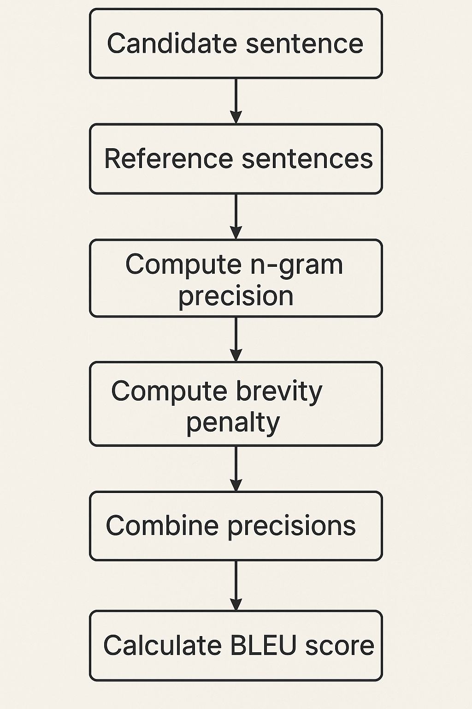

# LLM DEMO
## Table Of Contents

- [Basic Concepts](#1-basic-concepts)
    - [Token](#11-token)
    - [Parameters](#12-parameters)
    - [Embeddings](#13-embeddings)
    - [Transformer Architecture](#14-transformer-architecture)
    - [Fine Tuning](#15-fine-tuning)
    - [Perplexity](#16-perplexity)
    - [Accuracy](#17-accuracy)
    - [F1 Score](#18-f1-score)
    - [Recall](#19-recall)
    - [BlEU(Bilingual Evaluation Understudy)](#110-bleu-bilingual-evaluation-understudy)
    - [Rouge](#111-rouge)
    - [Prompt](#112-prompt)
    - [Hyperparameters](#113-hyperparameters)
- [Common pre-training objectives for LLM](#3-what-are-some-common-pre-training-objectives-for-llms-and-how-do-they-work)
- [Fine-Tuning](#4-fine-tuning)
    - [What is Fine-Tuning](#41-what-is-fine-tuning)
    - [Why Fine-Tuning Works](#-42-why-fine-tuning-works)
    - [Types of Fine-Tuning](#️-43-types-of-fine-tuning)
- [Techiques for controlling the out of an LLM](#6-techniques-for-controlling-the-output-of-an-llm)
- [Hyperparameters](#7-hyperparameters)
- [How can you incorporate external knowledge into an LLM](#8-how-can-you-incorporate-external-knowledge-into-an-llm)
    - [Knowledge Graph](#81-knowledge-graph-integration)
    - [RAG](#82-rag)
    - [Fine Tuning](#83-fine-tuning-with-domain-specific-data)
    - [Prompt Engineering](#84-prompt-engineering)
- [Comparison Between RAG and Fine-tuning](#8extra-comparison-between-rag-and-fine-tuning)
- [Agentic RAG](#9-agentic-rag)
    - [What is Agentic RAG](#what-is-agentic-rag)
    - [How does Agentic RAG Work](#how-does-agentic-rag-work)
    - [Comparison between Agentic RAG and Traditional RAG](#comparison-between-agentic-rag-and-traditional-rag)
- [Planner](#9extra-planner)
- [Three famous GraphRAG frameworks](#10-three-famous-graphrag-framekworks)
- [How can bias in prompt-based learning be mitigated?](#11-how-can-bias-in-prompt-based-learning-be-mitigated)
- [Catastrophic Forgetting](#12-catastrophic-forgetting)
    - [Prompt Calibration](#1-prompt-calibration)
    - [Fine Tuning](#2-fine-tuning)
    - [Data Agumentation](#3-data-augmentation)
- [LoRA](#13preknowledge-lora)
- [PEFT](#13-peft)
- [MOE](#14-moe)
    - [What is Mixture of Experts(MOE)](#what-is-mixture-of-experts-moe)
    - [Core Idea of MOE](#core-idea-of-moe)
    - [How MOE Works](#how-moe-works)
- [Adapter Tuning](#16-adapter-tuning)
- [Hallucination](#17-hallucinations)
    - [Definition](#definition)
    - [3 Main Types of Hallucinations](#three-main-types-of-hallucinations)
    - [How are LLM Hallucinations Detected](#how-are-llm-hallucinations-detected)
    - [Strategies to Reduce LLM Hallucinations](#strategies-to-reduce-llm-hallucinations)
- [Knowledge Distillation](#18-knowledge-distillation)
- [Model Uncertainty](#19-model-uncertainty)
- [Prompt Engineering](#20-prompt-engineering)
- [Chain of thought](#21-chain-of-thought-cot-prompting)
- [Quantitative metrics and Qualitative Evaluation](#22-quantitative-metrics-and-qualitative-evaluation)
    - [Quantitative Metrics](#quantitative-metrics)
        - [Common Quantitative Metrics](#common-quantitative-metrics)
    - [Qualitative Evaluation](#qualitative-evaluation)
- [Setup](#setup)


## 1. Basic Concepts
### 1.1 Token
- **Definition**: A token is the smallest unit of text the model processes — usually a word, subword, or symbol.
- **For Example**:
    - “I love cats” → `[I] [love] [cats]` (word-level tokenization)
    - “unbelievable” → `[un] [believ] [able]` (subword tokenization)
- **Why it matters**:
    - The model’s input and output lengths are measured in tokens, not characters or words.
    - LLM pricing, context length, and speed all depend on token count.
### 1.2 Parameters
- **Definition**: The parameters are the weights inside the neural network that the model learns during training.
They define how the model transforms input tokens into contextual representations.
- **Example**:
    - GPT-3 → 175 billion parameters
    - BERT → 340 million parameters
    - More parameters → greater capacity to model complex relationships.
### 1.3 Embeddings
- **Definition**: 
    - **Embeddings** are high-dimensional vector representations of words, sentences, or documents that capture **semantic meaning**.
    - Words with similar meanings (e.g., “happy” and “joyful”) are close together in embedding space.
- **Used for**:
    - Semantic search
    - Text similarity
    - Retrieval-Augmented Generation (RAG)

### 1.4 Transformer Architecture
- **Definition**:
    - The **Transformer** is the backbone of modern LLMs. It uses self-attention to model relationships between all tokens in a sequence simultaneously.
- **Key Components**:
    - **Encoder**: Reads and understands context (used in BERT, T5).
    - **Decoder**: Generates text autoregressively (used in GPT).
    - **Encoder-Decoder**: Both read and generate (used in T5, BART).
### 1.5 Fine-Tuning
- **Definition**:
    - Fine-tuning is the process of **adapting a pre-trained model** (e.g., GPT or BERT) to a specific domain or task by continuing its training on a smaller, focused dataset.
- **Purpose**:
    - Improves model performance for specific goals like sentiment analysis, summarization, or domain adaptation (e.g., legal or medical texts).
### 1.6 Perplexity
- **Definition**:
    - Perplexity measures **how well a language model predicts text**.
    - It’s the exponential of the average negative log-likelihood of the predicted tokens.
- **Formula**:
    - Perplexity=e^Loss
- **Interpretation**:
    - Low perplexity → confident and accurate predictions.
    - High perplexity → model is “surprised” by the actual text.
### 1.7 Accuracy
- **Definition**:
    - The proportion of correct predictions out of all predictions.
    - Often used in classification tasks (e.g., sentiment analysis).
- **Formula**:

### 1.8 F1 Score
- **Definition**:
    - Combines **precision** and **recall** into a single metric for evaluating classification performance.
    - Useful when data is imbalanced.
- **Formula**:
    - F1=2×(Precision*Recall)/(Precision+Recall)
    - ​
### 1.9 Recall
- **Definition**:
    - Recall measures how well the model identifies all relevant instances from the data.
    - It’s the proportion of actual positives that the model correctly predicts as positive.
- **Formula**:
    - Recall=(True Positives + False Negatives)/True Positives​
- 
### 1.10 BLEU (Bilingual Evaluation Understudy)
- **Definition**:
    - BLEU is a **text generation quality metric**, originally for machine translation.
    - It measures **n-gram overlap** between model-generated text and reference text.
- **Interpretation**:
    - BLEU = 1 (or 100) → perfect match with reference.
    - BLEU ≈ 0 → little to no overlap.
- **Used for**:
    - Translation, summarization, dialogue systems.
- **Diagram of BLEU**:
- 

### 1.11 ROUGE
- **Definition**:
    - ROUGE (Recall-Oriented Understudy for Gisting Evaluation) evaluates **how much of the reference text is captured** in the generated text.
- **Types**:
    - ROUGE-1 → unigram overlap
    - ROUGE-2 → bigram overlap
    - ROUGE-L → longest common subsequence
- **Used for**:
    - Summarization and paraphrasing evaluation.
### 1.12 Prompt
- **Definition**:
    - A **prompt** is the input text or instruction given to the LLM to guide its output.
    - The quality and structure of the prompt significantly affect model performance.
- **Example**:
    - “Explain quantum computing in simple terms.”
    - “Translate this to French: Hello, how are you?”
### 1.13 Hyperparameters
- **Definition**:
    - These are **tunable settings** that control how a model learns or generates text.
    - They are not learned from data but set manually before training or inference.
    - **Examples**:
        - Learning rate
        - Batch size
        - Temperature
        - Top-k / Top-p sampling
        - Max tokens
### 1.14 Context Window
- **Defintion**:
    - The **maximum number of tokens** a model can process at once.
    - Determines how much prior conversation or text the model can “remember.”
- **Example**:
    - GPT-3: 4K tokens
    - GPT-4-turbo: 128K tokens
    - Claude 3: up to 200K tokens
### 1.15 Embedding Space & Similarity

## 3. What are some common pre-training objectives for LLMs, and how do they work?
### 3.1  Masked Language Modeling (MLM)
- **Used in models like**: BERT, RoBERTa
- **How it works**:
    - Random tokens in a sentence are masked (replaced with `[MASK]`).
    - The model is trained to predict the masked word using both left and right context (i.e., it's **bidirectional**).
### 3.2 Autoregressive Language Modeling (AR)
- **Used in models like**: GPT, GPT-2, GPT-3, GPT-4

## 4. Fine-Tuning
### 4.1 What Is Fine-Tuning?
- **Fine-tuning** is the process of taking a **pre-trained** language model (like GPT, BERT, or T5) and training it further on a **smaller**, **domain-specific** dataset to make it perform better on a **specific task or language style**.
- A pre-trained model has already learned:
    - grammar, syntax, and general world knowledge
    - context relationships between words and phrases
    - reasoning patterns and text structure
- However, it doesn’t yet “know” how to handle **specialized tasks**, like:
    - classifying sentiment (e.g., positive/negative reviews),
    - generating medical summaries,
    - extracting entities from legal documents,
    - or answering customer queries in a specific tone.
- Fine-tuning adapts this general knowledge to **task-specific objectives**.

#### 🧠 4.2 Why Fine-Tuning Works
- When a model like DistilBERT is pre-trained:
    - It learns general knowledge of language patterns.
    - But it doesn’t know how to perform **task-specific** jobs like classifying IMDb reviews as positive or negative.

#### ⚙️ 4.3 Types of Fine-Tuning
- **Full Fine-Tuning**
    - The **entire model’s parameters** are updated on the new dataset.
    - Pros:
        - Maximum flexibility and task adaptation.
    - Cons:
        - Requires large compute resources (GPUs/TPUs).
        - Risk of **catastrophic forgetting** (losing general knowledge).

- **Parameter-Efficient Fine-Tuning (PEFT)**
#### 🔍 4.4 Fine-Tuning Workflow
1. **Start from a pre-trained base model (e.g., `bert-base-uncased`, `gpt-3.5-turbo`).**
2. **Prepare your dataset:**
- Input–output pairs, labeled text, or conversation data.
- Split into train/validation sets.
3. Choose the fine-tuning method:
- Full fine-tuning, PEFT, or instruction tuning.
4. **Train the model:**
- Define hyperparameters (learning rate, epochs, batch size).
- Use frameworks like Hugging Face Transformers or OpenAI Fine-tuning API.
5. Evaluate:
- Metrics: accuracy, F1 score, BLEU, or perplexity (depending on the task).

## 5. **How do you measure the performance of an LLM?**
#### 5.1 🔢 Perplexity
- **definition**:
Perplexity is a measurement of how well a language model predicts a sequence. It is the exponential of the average negative log-likelihood of the predicted tokens.
- **formula**:
Perplexity = *e*^Loss
- **interpretation**:

**Low perplexity** → Model is confident and accurate in predicting the next tokens.
**High perplexity** → Model is "surprised" by the actual tokens.
#### 5.2 🧮 Accuracy
- **definition**:
Accuracy is the ratio of **correct predictions to total predictions**. It is commonly used in classification tasks (e.g., sentiment analysis, text classification).
- **formula**:
Accuracy = Number of Correct Predictions / Total Predictions
#### 5.3 F1 Score
- **definition**:
F1 Score is the **harmonic mean** of Precision and Recall. It is especially useful for imbalanced datasets.

- **Precision** = How many of the predicted positives are correct?

- **Recall** = How many of the actual positives did the model catch?

- **formula**:
F1=(2*Precision*Recall)/(Precision+Recall)

#### 5.4

## 6. Techniques for Controlling the Output of an LLM
These methods let developers influence how a model responds, balancing between randomness, relevance, creativity, and determinism.
### 6.1 🔥 Temperature
#### **What it does:** 
Controls the level of randomness in token selection.
#### **How it works:** 
During generation, the model uses probabilities to decide the next token. Temperature scales these probabilities:
- A **lower value** (e.g., 0.2) sharpens the distribution — the model is more confident and **chooses the most likely next word**, producing **deterministic and repetitive** outputs.
- A **higher value** (e.g., 1.0 or 1.5) flattens the distribution, allowing for more **diverse, creative, and unpredictable** text.

#### 🧊 Low Temperature (temperature=0.2)
- Explanation:
    - The output is **coherent**, **rhythmic**, and **safe**.
    - GPT-4 chooses tokens with the highest probability, so it sticks to standard poetic themes.
    - Less creative surprises, but more syntactically correct and “professional” sounding.

- ✅ Ideal for:
    - Factual tasks
    - Formal documentation
    - Summarization
    
####  High Temperature (temperature=1.0)
- Explanation:
    - The output is **more imaginative and colorful**.
    - Words like "Emerald galaxies", "ink-black canvas" indicate a **creative leap**.

### 6.2 🎯 Top-K Sampling
- **What it does**: Restricts the token selection pool to the **top K most probable tokens** at each generation step.
- **How it works**: If `top_k=50`, the model only chooses from the top 50 most likely next tokens rather than considering all options.


### 6.3 Top-p Sampling
#### 🔍 What Is Top-P Sampling?
Top-P sampling chooses from the smallest set of tokens whose cumulative probability exceeds the threshold p. Lower values restrict choice to high-confidence tokens; higher values allow more diverse token selection.

#### Explanation in Example
- 0.3:
    - **Summary**: Output is short and nearly identical to 0.6; it stops mid-sentence.
    - **Behavior**: Most focused — selects tokens only from the top ~30% cumulative probability mass. Tends to be **highly relevant but less diverse**.
- 0.6:
    - **Summary**: Nearly identical to 0.3.
    - **Behavior**: Balanced — more flexible than 0.3 but still somewhat focused, but still constrained to safe outputs.
- 0.8 
    - **Summary**: Output starts to diversify — adds some background explanation.
## 7. Hyperparameters
### What are LLM Parameters?
- **Parameters** are the internal values of a model that are **learned automatically during training**.
- They define how the model interprets input and produces output.
- **Examples**
    - **Weights** — the strength of connections between neurons.
    - **Biases** — the offset added to activations before applying non-linear functions.
- In mathematical terms, for a single neuron:
    - y=f(Wx+b)
- where:
    - 𝑊 → weights (parameters)
    - 𝑏 → bias (parameter)
    - f → activation function (e.g., ReLU or GELU)
    - 𝑦 → output of that layer
- 𝑦 → output of that layer
- When you train a large model like GPT, the training algorithm (usually gradient descent) **adjusts millions or billions of these weights and biases** so the model’s predictions match real examples.

### How LLM Parameters Are Learned
- Parameters are updated during training using **backpropagation** and **gradient descent**:
    - The model predicts an output (e.g., next token).
    - The loss function (like cross-entropy) compares prediction vs. ground truth.
    - The optimizer computes **gradients** (how much each parameter contributed to the error).
    - Parameters are updated:
    $$
    \theta_{new} = \theta_{old} - \eta \cdot \nabla_{\theta}L
    $$
    - where:
        - 𝜃 → parameter (weight/bias)
        - 𝜂 → learning rate (hyperparameter)
        - L → loss function
- This process repeats billions of times until the model “learns” patterns in the dataset.

### What are Hyperparameters?
- Hyperparameters are **external configuration settings** that control how the model learns — not what it learns.
- Unlike parameters, **hyperparameters are not learned automatically**.
- They are set manually before or during training and can drastically change the model’s quality, speed, and stability.
- **Examples**
    - **Learning rate** → how big each update step is.
    - **Batch size** → how many samples per update.
    - **Number of layers**, **hidden size**, **number of heads** → define model architecture.
    - **Dropout rate**, **weight decay** → regularization strength.
    - **Temperature**, **top-p**, **top-k** → affect randomness during generation.
### Relationship Between Parameters and Hyperparameters

| **Category**       | **Parameters**                               | **Hyperparameters**                           |
| ------------------ | -------------------------------------------- | --------------------------------------------- |
| **Definition**     | Internal weights/biases learned by the model | External settings chosen by humans            |
| **Examples**       | Layer weights, embedding vectors, biases     | Learning rate, batch size, dropout            |
| **Who sets them?** | Automatically updated by optimizer           | Defined manually by developer                 |
| **Storage**        | Inside model checkpoint                      | In config or training script                  |
| **Effect**         | Determines model knowledge                   | Determines training behavior and output style |

## 8. How can you incorporate external knowledge into an LLM?
- LLMs (Large Language Models) are trained on vast corpora of text, but their knowledge is static — limited to what they saw during training.
- To make them useful in **real-world**, **dynamic**, or **domain-specific applications**, we can inject external knowledge in several ways:
### 8.1 Knowledge Graph Integration
#### 🧠 What Are Knowledge Graphs?
- A **Knowledge Graph (KG)** is a structured representation of information that uses graph-based data structures to describe how different entities (like people, places, or things) are connected to one another.
- It serves as a **knowledge base** that represents facts in the form of nodes and edges:
    - **Nodes** = entities (e.g., “Paris”, “France”, “Eiffel Tower”)
    - **Edges** = relationships between those entities (e.g., “is located in”, “was built in”)
- For example:
```scss
    (Paris) — [is the capital of] → (France)
    (Eiffel Tower) — [is located in] → (Paris)
```
- This structure makes KGs not just data stores, but **semantic networks** — they understand meaning and relationships, not just raw text.

#### 🔍 Key Features of Knowledge Graphs
1. **Semantic Relationships**
- KGs capture **meaningful connections** between entities, based on **semantics** rather than just keyword matching.
- For instance, a KG understands that “Paris” and “France” are related through the relationship “is capital of,” which is very different from a simple co-occurrence in text.
- This semantic layer enables logical reasoning, contextual search, and better inference by LLMs.

2. **Queryable Structures**
- Knowledge graphs are typically stored in graph databases such as **Neo4j** or **Amazon Neptune**.
- These databases support **graph query languages** such as **SPARQL** (for RDF-based graphs) and **Cypher** (for property graphs).
- Such queries can perform complex reasoning, e.g.:
    - “Find all scientists born in Germany who won a Nobel Prize.”

3. **Scalability for Handling Vast Information**

### 8.2 RAG
##### Concept
- RAG combines **retrieval** (finding relevant data) with **generation** (LLM producing output).
- When the user asks a question, the system first retrieves documents or passages from a **vector database(VDB)** — such as FAISS or Chroma — and then **feeds those retrieved chunks** into the prompt context for the LLM to generate a grounded answer.
- **Pipeline**:
1. Embed all documents into vectors and store in a database.
2. Convert the user query to an embedding vector.
3. Retrieve similar chunks using cosine similarity.
4. Pass retrieved chunks + question → LLM for response.
### 8.3 Fine-Tuning with Domain-Specific Data
- **Concept**:
    - Fine-tuning allows an LLM to specialize in a specific domain — for example, medical terminology, legal reasoning, or software engineering — by training it further on curated datasets.
    - This approach **changes model weights** to integrate domain expertise permanently.
- **Process**:
1. Collect domain-specific training data (e.g., Q&A pairs).
2. Format it properly (JSONL for supervised fine-tuning).
3. Train the model using frameworks like Hugging Face Transformers.

### 8.4 Prompt Engineering
#### 🧩 Definition and Core Concepts
- Prompt engineering is the **art and science of designing prompts**—structured questions or instructions—to guide an AI model, especially a Large Language Model (LLM), toward a desired output.
- It acts as the **interface between human intent and machine output**, determining how clearly the model understands and executes a task.
- Think of prompt engineering like teaching a child through questions:
    - A vague prompt (“Tell me about space”) yields a generic answer.
    - A refined prompt (“Explain how black holes distort space-time using an analogy”) guides reasoning toward a **specific goal**.
##### ⚙️ The Technical Side of Prompt Engineering
- Prompt engineering is not only about wording—it also relies on an understanding of **LLM internals**, which influence how prompts are processed and interpreted.
1. **Model Architectures**
- Large Language Models like GPT, BERT, or LLaMA are built on Transformer architectures.
- Transformers use **self-attention mechanisms** to understand context by weighing the importance of each word in a sequence relative to others.
- Understanding this helps prompt engineers design better context-driven inputs:
    - Place key information at the **beginning** of the prompt.
    - Maintain consistent **instruction** → **context** → **question** flow.
    - Avoid overly long or redundant inputs that dilute attention focus.
2. **Training Data and Tokenization**
- LLMs are trained on massive datasets and process text as **tokens**—smaller units of meaning.
- The model’s understanding of a prompt depends on **how it tokenizes** words.
- For instance:
    - "ChatGPT" might be one token in one model, two in another.
    - Token limits (like 4096 or 8192) also affect how much context fits in memory.
3. **Model Parameters**:
- Each LLM has millions or billions of parameters that determine its learned representations.
- During fine-tuning, these parameters adjust how the model responds to instructions.
- While users can’t modify parameters directly, understanding their role helps interpret **model bias**, **style**, and **confidence**.

## 8Extra. Comparison between RAG and Fine-tuning
- Both **Fine-Tuning** and **Retrieval-Augmented Generation (RAG)** are powerful strategies for adapting and improving Large Language Models (LLMs).
- They differ in **how** they enhance model performance and **when** each is best used.
#### Concept Overview:
| Aspect               | **Fine-Tuning**                                                                                                 | **Retrieval-Augmented Generation (RAG)**                                                                             |
| -------------------- | --------------------------------------------------------------------------------------------------------------- | -------------------------------------------------------------------------------------------------------------------- |
| **Definition**       | Involves retraining a pre-trained model on domain-specific labeled data to specialize it for a particular task. | Combines a retriever (that fetches relevant external information) with a generator (that produces the final output). |
| **Goal**             | Embed new knowledge *inside* model weights.                                                                     | Provide up-to-date or specialized knowledge *from external sources* without retraining.                              |
| **Knowledge Source** | Static — knowledge becomes part of model parameters after training.                                             | Dynamic — knowledge retrieved in real time from databases or documents.                                              |
| **Example Use**      | A medical chatbot trained specifically on clinical notes.                                                       | A legal assistant retrieving the latest laws and case summaries.                                                     |

#### ⚙️ How Each Works
- **Fine-Tuning Process**:
1. Gather a **labeled dataset** relevant to the domain (e.g., customer support dialogues).
2. Use supervised training to adjust model weights.
3. Evaluate and deploy the fine-tuned model for consistent, domain-specific tasks.
- **RAG Process**:
1. **Retriever** component searches a vector database or knowledge graph for relevant context.
2. The retrieved information is inserted into the model prompt.
3. The **generator** (LLM) uses this context to produce a more factual and context-aware response.

#### ⚡ Key Benefits of RAG
1. **Dynamic Knowledge Integration** – RAG can access real-time or evolving information from external databases, APIs, or documents.
2. **Contextual Relevance** – It enhances model outputs by adding retrieved evidence or context directly into prompts.
3. **Versatility** – Works well across diverse or open-ended tasks where fine-tuning data might be limited or unavailable.
#### 🧠 Key Benefits of Fine-Tuning
1. **Deep Domain Specialization** – Embeds domain-specific knowledge directly into model parameters.
2. **Custom Behavior Control** – Tailors model tone, format, and reasoning style for specialized applications.
3. **Offline Operation** – Once trained, fine-tuned models can operate without external knowledge sources.

## 9. Agentic RAG
### What is Agentic-RAG
#### **🧠 Overview**
- Agentic RAG (Retrieval-Augmented Generation) is an advanced evolution of the traditional RAG framework.
- It integrates the reasoning and autonomy of AI agents with the retrieval power of RAG, creating intelligent systems that can plan, retrieve, and reason proactively rather than reactively.
#### **⚙️ Core Components of Agentic RAG**:
- Agentic RAG combines two foundational AI concepts: AI Agents and RAG.
1. **AI Agent**:
- An AI agent is an autonomous entity capable of:
    - **Perceiving its environment** (input, data sources, user intent),
    - **Making decisions** about what to do next,
    - **Taking actions** through tools, APIs, or retrieval systems,
    - **Evaluating outcomes** and improving over time.
2. **Retrieval-Augmented Generation (RAG)**:
- **RAG** bridges the gap between static AI models and dynamic, real-world data.
- Instead of relying solely on pre-trained knowledge, RAG systems:
    - **Retrieve** up-to-date, factual information from sources such as APIs, databases, or knowledge graphs.
    - **Augment** the prompt context with this retrieved content.
    - **Generate** a response that is both accurate and grounded in real data.
- This makes RAG powerful in domains like healthcare, finance, and education, where **real-time data** accuracy is crucial.
#### 🤝 The Fusion: How Agentic RAG Combines Both
| Concept                        | Role in Agentic RAG                                                                              |
| ------------------------------ | ------------------------------------------------------------------------------------------------ |
| **Autonomy**                   | The agent decides what steps to take next without explicit instruction.                          |
| **Dynamic Retrieval**          | The system pulls the most relevant, real-time data from multiple sources.                        |
| **Reasoning + Planning**       | The agent decomposes complex queries into smaller subtasks and selects tools dynamically.        |
| **Feedback + Self-Reflection** | The model evaluates its own answers, re-queries when uncertain, and iteratively refines outputs. |

### How Does Agentic RAG Work?
- **Agentic RAG** builds on standard Retrieval-Augmented Generation by adding agency — that is, autonomous decision-making, adaptive retrieval, and iterative improvement.
- It operates through four foundational pillars:
1. **Autonomy**
- The agent takes full control of the entire process — from identifying what’s missing to producing the final answer.
    - It doesn’t wait for explicit human instructions.
    - If it detects incomplete data or unclear context, it autonomously determines what additional information is needed.
    - This independence makes it a **proactive problem-solver** rather than a reactive one.
- **Example**:
    - When asked a question that requires up-to-date statistics, an Agentic RAG agent identifies the data gap, queries an external API for current information, and integrates it — all without manual prompting.
2. **Dynamic Retrieval**
- Unlike traditional RAG (which retrieves from static corpora), Agentic RAG performs **real-time**, **adaptive data retrieval**.
    - It dynamically selects which retrieval pipeline to use (e.g., vector DB, API, or web search).
    - It can query APIs, databases, or knowledge graphs to fetch the **most relevant and recent data**.
    - The agent optimizes retrieval based on context, domain, and task complexity.
- **Example**:
    - For a financial report generator, Agentic RAG fetches the latest stock prices and quarterly data rather than relying on stale embeddings.
3. **Augmented Generation**
- Retrieved data isn’t simply pasted into the output — it’s **processed**, **contextualized**, and **reasoned over**.
    - The system fuses **external factual data** with its **internal model reasoning**.
    - This produces **coherent**, **contextually rich answers** that combine accuracy and natural language fluency.
    - It essentially upgrades the model from a “retriever + generator” to an **intelligent reasoning assistant**.
4. **Continuous Feedback Loop**:
- The feedback mechanism allows the system to **evaluate and refine** its own outputs.
    - After generating a response, it checks for factual gaps or reasoning errors.
    - The feedback layer can automatically re-query missing information or replan steps.
    - Over time, this loop helps the model **learn from prior runs**, improving performance and adaptability.
- **Exapmle**:
    - If an answer receives low confidence or contradicts earlier retrieved evidence, the feedback loop triggers a refinement step — fetching additional context and regenerating a more accurate response.
    
### Comparison Between Agentic RAG and Traditional RAG
#### Conceptual Overview:
- Traditional RAG (Retrieval-Augmented Generation) systems work in a reactive manner — they depend on explicit human queries and predefined retrieval rules. In contrast, Agentic RAG introduces autonomy, context-awareness, and self-directed reasoning, enabling the model to decide what to retrieve, when, and why without needing continuous user guidance.
#### ⚙️ Traditional RAG
- Traditional RAG systems:
    - Follow a fixed pipeline: Retrieve → Generate → Respond.
    - Require **explicit**, **well-structured user queries**.
    - Retrieve information based only on static embeddings or indexes.
    - Lack contextual adaptability — they do not replan or refine when retrieval fails.
    - Depend on human input for error correction or deeper exploration.
- **Analogy**:
    - Traditional RAG is like visiting a library with a list of book titles — it retrieves exactly what you ask for, but won’t help you interpret, expand, or cross-reference the material.
##### Agentic RAG
- Agentic RAG systems, on the other hand, are **proactive and self-managing**:
    - Include **autonomous agents** (Planner, Retriever, Synthesizer, Critic) that collaborate dynamically.
    - Continuously analyze user intent, **decompose complex questions**, and route subtasks to specialized retrievers or APIs.
    - Integrate data from **multiple sources** — databases, web, APIs, knowledge graphs — in real time.
    - Employ a **feedback loop** to self-correct, re-query, or refine answers if evidence is weak or inconsistent.
    - Produce **coherent**, **multi-layered**, and **contextually enriched** responses.
- **Analogy**:
    - Agentic RAG is like hiring a research assistant who not only finds the most relevant books but also reads them, summarizes the findings, cross-checks facts, and delivers a polished report — saving both time and effort.

## 9Extra. Planner
### Question:How does the planner agent in AgenticRAG handle complex queries?
1. **Decomposition**
    - It converts the single complex query into a set of **manageable**, **dependency-aware sub-queries**. This prevents one monolithic retrieval step from missing critical evidence.
2. **Specialized routing**
    - Each sub-query is mapped to the **best retrieval pipeline**: vector DB for semantic needs, BM25 for keyword-exact matches, SQL for analytics, KG for relationship queries, code search for repos, or external APIs (web, Github, Jira).
3. **Parallel + staged execution**
    - Independent sub-queries run **in parallel** for speed; dependent ones wait for upstream evidence (e.g., use ticket analytics to parameterize later searches).
4. **Adaptive refinement**
    - If a sub-query returns weak/conflicting evidence, the planner can **replan**: widen time windows, change retrievers (e.g., try hybrid), increase top-k, or add a new sub-query (e.g., “look for failure modes in billing tickets”).
5. **Budgeting & guardrails**
    - It enforces limits (tokens, calls, top-k) and uses early-stop criteria when confidence is high enough—important for cost and latency.

## 10. Three Famous GraphRAG Framekworks
### Microsoft GraphRAG
- **GitHub**: microsoft/graphrag(https://github.com/microsoft/graphrag)
- **Overview**
    - Microsoft **GraphRAG** is an advanced framework that combines **RAG (Retrieval-Augmented Generation)** with **knowledge graph reasoning**.
    - It’s designed for **enterprises** that need deep document understanding and contextual retrieval.
- **Key Features**
    - Structured + Unstructured Knowledge Fusion:
### LightRAG
- **Overview**
    - 
## 11. How can bias in prompt-based learning be mitigated?
### 1. Prompt Calibration
- This involves carefully designing and testing prompts so that the LLM produces balanced, unbiased responses.
- For example, if a model tends to associate certain professions with specific genders, you can test multiple prompt formulations and adjust phrasing to reduce bias.
- **Example**:
    - Uncalibrated: “The nurse said he…” → likely produces bias.
    - Calibrated: “A person working as a nurse said…” → reduces gender association.

### 2. Fine-Tuning
- Fine-tuning retrains a pre-trained model on **diverse and balanced datasets**.
- This process teaches the model to correct its biased patterns learned during pretraining.

### 3. Data Augmentation
- This expands your dataset with **synthetic or mirrored examples** that counteract bias.
- For example:
    - If 70% of your data says “doctor → he,” generate more examples with “doctor → she.”
    - Use paraphrasing or back-translation to diversify data linguistically.

## 12. catastrophic forgetting
### Definition:
- Catastrophic forgetting (or catastrophic interference) is the phenomenon where a neural network **forgets previously learned tasks** after being fine-tuned on new data.
- In the context of LLMs, it means:
    - When you fine-tune a model (like GPT, BERT, or T5) on a new dataset or task, its performance on older tasks suddenly drops dramatically.

### ⚙️ Why It Happens (Mechanism):
1. **Shared Parameters**
- In deep neural networks, the same weights are used across many tasks.
- When fine-tuning, backpropagation updates these shared parameters to fit the new task.
2. **No Replay Memory**:
- Unlike humans, models don’t “remember” earlier tasks unless we retrain them together.
- They only see the new task’s dataset — and gradients push them entirely toward that new distribution.
3. **High Capacity Models Still Forget**:
- Even very large LLMs (billions of parameters) are not immune.
- Their large capacity helps, but without constraints or regularization, they still optimize for the current objective and drift away from older ones.
#### 🧩 Mitigation Techniques
| **Technique**                                  | **How It Works**                                                                        | **Why It Helps**                                                                |
| ------------------------------------------ | ----------------------------------------------------------------------------------- | --------------------------------------------------------------------------- |
| **PEFT (Parameter-Efficient Fine-Tuning)** | Freezes most weights and trains small adapter modules (like LoRA or prefix tuning). | Preserves old knowledge in frozen weights.                                  |
| **EWC (Elastic Weight Consolidation)**     | Penalizes changes to parameters that are important for old tasks.                   | Uses Fisher Information Matrix to identify which parameters are “critical.” |
| **Replay / Rehearsal**                     | Mixes data from old and new tasks during fine-tuning.                               | Helps maintain representation balance.                                      |
| **Regularization Methods**                 | Adds penalty terms that discourage large weight shifts.                             | Keeps parameters near their old values.                                     |

#### 🧮 Intuitive Analogy
- Think of the model’s parameters as a **shared whiteboard**:
    - During pretraining, it writes general knowledge.
    - During fine-tuning, it writes notes for new tasks.
- If you erase and overwrite everything for the new topic (without saving the old ones), you lose the old knowledge — that’s catastrophic forgetting.
- Techniques like PEFT or EWC act like:
    - **PEFT**: “Write on sticky notes” (small, new parameters) — don’t touch the main whiteboard.
    - **EWC**: “Highlight what’s important and don’t erase it” — preserve critical parts of the old notes.

## 13PreKnowledge. LoRA
### What is Low-Rank Adaptation (LoRA)?

**Low-Rank Adaptation (LoRA)** is a **parameter-efficient fine-tuning (PEFT)** technique designed to adapt large pre-trained models for specific tasks **without significantly increasing computational or memory costs**.

As large language models (LLMs) grow in size and complexity, fine-tuning them on new tasks often requires **substantial computational power and GPU memory**.  
LoRA solves this problem by reducing the number of trainable parameters — making the fine-tuning process **faster, lighter, and more efficient**.

---

### 🧠 Key Idea

LoRA modifies the standard fine-tuning process by **inserting small trainable low-rank matrices** into specific layers (typically the attention projections) of a frozen pre-trained model.  
Instead of updating the full parameter matrix \( W \), LoRA decomposes it into two smaller matrices \( A \) and \( B \):

\[
W' = W + A \cdot B
\]

- \( W \): Original frozen weight matrix  
- \( A \): Low-rank matrix of size \( d \times r \)  
- \( B \): Low-rank matrix of size \( r \times d \)  
- \( r \): Rank (typically much smaller than \( d \))

Only \( A \) and \( B \) are trained, while \( W \) remains frozen — significantly reducing computational overhead.

---

#### ⚙️ Architecture of LoRA

- LoRA is typically integrated into **Transformer-based models** (like GPT, BERT, or T5).  
- Here’s how it works step by step:

1. **Pre-Trained Backbone**  
   - Begin with a large transformer model that has already been trained on massive general-purpose data.

2. **Low-Rank Adaptation Layers**  
   - Insert small, trainable low-rank matrices \( A \) and \( B \) into specific attention projection layers (e.g., query or value matrices).  
   - These are the *only* parameters that get updated during fine-tuning.

3. **Frozen Original Parameters**  
   - The original model weights remain **frozen**.  
   - This ensures that general language knowledge is preserved and prevents **catastrophic forgetting**.

4. **Task-Specific Fine-Tuning**  
   - Fine-tune only the low-rank matrices for a specific task (like sentiment analysis or translation).  
   - The model learns the new task efficiently while maintaining previous capabilities.

## 13. PEFT
### What is PEFT?
- **Parameter-Efficient Fine-Tuning (PEFT)** adapts a frozen pretrained model by training only a small set of extra parameters (or a tiny subset of existing ones). The backbone weights stay fixed, so you keep the general knowledge while learning a new task/domain cheaply.
### Major PEFT families (how they plug in)
#### **LoRA (Low-Rank Adapters)**
Learn two small matrices \( A \in \mathbb{R}^{d \times r} \), \( B \in \mathbb{R}^{r \times d} \) and add their product to a frozen weight \( W \):

\[
W' = W + \alpha \cdot A B
\]

Usually applied to attention projections (**q/v**).  
Only \( A, B \) train (rank \( r \ll d \)).

---

#### **Adapters (Bottleneck Blocks)**
Insert a tiny MLP after (or inside) Transformer sublayers:

\[
h \mapsto h + W_\text{up} \, \sigma(W_\text{down} \, \text{LN}(h))
\]

Initialize near identity so the model starts as the base model; only adapter weights train.

---

#### **Prefix / Prompt / P-Tuning**
Learn a small set of **virtual tokens** (or key/value *prefixes*) prepended per layer or sequence — only these embeddings are trainable.

---

##### **IA³ / Gating / BitFit**
Learn per-channel scaling vectors (**IA³**) or just biases (**BitFit**).  
Extremely small parameter count.
### Why PEFT prevents catastrophic forgetting
- **Catastrophic forgetting** happens when you update the shared backbone and overwrite features needed for older tasks. PEFT avoids that by design:
    - **Parameter isolation**:
        - The backbone is frozen. New knowledge lives in the tiny trainable pieces (LoRA `𝐴`,`𝐵`, adapter layers, prefixes). Old capabilities aren’t overwritten because their weights never change.
    - **Identity initialization**:
        - Adapters/LoRA start as (near) identity/zero-update, so training nudges behavior locally instead of globally rewriting representations.
    - **Low-rank / low-capacity updates**
        - Constraining updates (e.g., low rank 𝑟) regularizes changes; you can’t drastically deform the function even if you try.
    - **Task modularity**:
        - You can **keep one adapter per task**. Switching tasks is swapping small modules—no retraining, no interference. (If you fine-tune Task B, Task A’s adapter is untouched.)
    - **Reversibility**:
        - With LoRA you can “merge” or simply **detach** the adapters; the original backbone remains intact on disk.
### When PEFT might not be enough
- Huge domain shift or very complex tasks → increase LoRA rank / adapter width, or fall back to partial/full fine-tuning.
- If you keep updating the **same** adapter sequentially across tasks, you can still forget—use separate adapters or multi-task training.

## 13. Vector Store Use Case
#### 🧠 Detailed Explanation
- A **vector store** (or **vector database**) stores embeddings — numerical representations of text that capture semantic meaning rather than literal words.
- This allows the model to **search by meaning** (semantic similarity) instead of by exact keyword matches.
#### When You Need a Vector Store
- Vector stores are essential when your LLM must **retrieve external knowledge** to ground its responses.
- Examples include:
    - **Document Retrieval / Question Answering**
    - **Chat with Documents / PDFs / Knowledge Base**
    - **Retrieval-Augmented Generation (RAG) systems**
- **Reason**:
    - LLMs have limited context windows and can’t remember all your documents.
    - A vector store allows dynamic retrieval of relevant text based on embeddings created by models like text-embedding-3-small.

#### When You Don’t Need a Vector Store
- Tasks like:
    - **Text summarization**
    - **Translation**
    - **Paraphrasing**
    - **Sentiment classification**
    - **Simple conversation flows**

#### ⚖️ Summary Table
| Task Type               | Requires Vector Store? | Why                            |
| ----------------------- | ---------------------- | ------------------------------ |
| Document Q&A / RAG      | ✅ Yes                 | Needs semantic retrieval       |
| Knowledge-grounded chat | ✅ Yes                 | Pulls facts from stored data   |
| Summarization           | ❌ No                  | Uses text directly             |
| Translation             | ❌ No                  | Pure sequence-to-sequence task |
| Sentiment analysis      | ❌ No                  | Only depends on input text     |

## 14Pre. FLOP
### What “FLOP” Means
- FLOP stands for Floating-Point Operation — a single arithmetic computation (like addition or multiplication).
- When we talk about “FLOPs” in deep learning, we usually mean the **total number of floating-point operations needed** to run a model (per token, per batch, or per forward pass).
- For example:
    - A dense Transformer layer might require ~10⁹ FLOPs per token.
    - A Mixture of Experts layer (with sparse activation) might require only ~2×10⁸ FLOPs, even if its total parameters are much larger.
- So **FLOPs** ≈ **computational cost**.

### What “Quality-per-FLOP” Means
- **Quality-per-FLOP measures** how much performance or output quality you get for each unit of computation.
- Quality-per-FLOP=Number of FLOPs/Model Quality Metric​
- **Example Quality Metrics**
| **Domain**          | **Quality Metric**                     |
| ------------------- | -------------------------------------- |
| Language modeling   | ↓ **Perplexity** (lower = better)      |
| Classification      | ↑ **Accuracy** / **F1 score**          |
| Machine translation | ↑ **BLEU score**                       |
| Reasoning           | ↑ **Success rate**, **Win rate**, etc. |

### 
## 14. MoE
### What is Mixture of Experts (MoE)?
- **Mixture of Experts (MoE)** is a machine learning technique that divides a large neural network into multiple sub-networks (experts).
- Each expert specializes in a **subset of the input space** or **type of task**, and a **gating network** dynamically decides **which experts to activate** for a given input.
### Core Idea of Moe
- Instead of activating the entire neural network for every input (which is computationally expensive), MoE activates **only the relevant experts**.
- This design **reduces computation cost**, **allows parallelization**, and enables scaling up model parameters without proportionally increasing inference time.
### How MoE Works
1. **Overview**
- A **Mixture of Experts** model divides a large neural network into multiple **expert sub-networks**, each focusing on a **specific subset of input patterns or tasks**.
- However, instead of using all experts at once, MoE activates **only a few experts** per input using a **gating network (or router)**.
2. **The Role of the Gating Network**
- The **gating network** (or router) is a small neural network trained to decide **which experts to activate**.
- It produces a **probability distribution** over all experts.
- Only the **Top-K experts** (e.g., 2 out of 8) are selected per input based on these probabilities.
- Formally:
$$
w = \text{softmax}(W_g x)
$$
- where:
    - 𝑥 = input token representation
    - 𝑊𝑔 = gating network weights
    - 𝑤 = expert weight vector
- Then the final output:
$$
y = \sum_{i \in \text{Top-K}} w_i \cdot E_i(x)
$$
- where 𝐸𝑖(𝑥) is the output of expert 𝑖.
- This ensures **sparse activation**, meaning only a few experts work at a time, keeping computations efficient.
3. **Sparsity = Efficiency + Scale**
- In a normal dense neural network:
    - Every input goes through **every neuron** or **every layer**.
    - Computation cost scales with model size.
- In a **Mixture of Experts** model:
    - Only a small number of experts (e.g., 2 of 64) are active for each token.
    - Thus, even with **hundreds of billions of parameters**, computation per token remains roughly constant.
### How MoE makes LLMs improve the efficiency of LLM
1. **Sparsity (conditional computation)**
- In a dense Transformer, every token passes through every FFN in every layer.
2. **Capacity ↑ without compute ↑**
- Because only K experts run, you can scale to **hundreds of billions/trillions of params** while keeping **FLOPs per token roughly constant**.
- This yields **higher representational power** (more specialists) at **similar inference cost** to a smaller dense model.
3. **Specialization improves quality-per-FLOP**
- 
### How does LLM use MoE?
1. **Why LLMs Use MoE**
- Large Language Models (LLMs) like GPT-4, Mixtral, and Switch Transformer have **hundreds of billions** (or even **trillions**) of parameters.
- The challenge:
    - Training and running all parameters at once is **computationally** and **financially massive**.
    - Not all neurons or layers are needed for every input token.
    - Many tokens require **specialized processing** (e.g., code vs. poetry vs. math).
- **Solution → Mixture of Experts (MoE)**:
    - LLMs integrate MoE to increase capacity (number of parameters) **without increasing inference cost**.

2. **Where MoE Fits Inside an LLM**
- In a typical Transformer-based LLM, each layer has:
```css
[ Multi-Head Attention ] → [ Feed-Forward Network (FFN) ]

```
- LLMs **replace the dense FFN block** with a **Mixture of Experts (MoE)** block.
```css
Input → Attention → MoE Layer (Experts + Gating) → Output

```
3. **How It Works (Step-by-Step)(Similar with what has already been showed above)**
4. **Real-World Examples in LLMs**

| **Model**                            | **Architecture**            | **Active Experts per Token** | **Notes**                                                  |
| ------------------------------------ | --------------------------- | ---------------------------- | ------------------------------------------------------ |
| **Google Switch Transformer (2021)** | 1.6T parameters, 64 experts | 1 expert per token           | First large-scale MoE LLM                              |
| **GLaM (Google, 2021)**              | 1.2T parameters             | 2 experts per token          | Balanced routing improves diversity                    |
| **Mistral Mixtral 8×7B (2024)**      | 8 experts × 7B each         | 2 experts per token          | Efficient open-weight MoE LLM                          |
| **DeepSeek-V2 (2024)**               | 236B total                  | 2–4 experts per token        | Specialized experts for coding, math                   |
| **GPT-4 (rumored)**                  | MoE-based                   | Unknown                      | Believed to route tokens across multiple expert towers |

5. **Why This Is So Powerful**

| Advantage             | Explanation                                                                    |
| --------------------- | ------------------------------------------------------------------------------ |
| **Scalable capacity** | You can scale to trillions of parameters without increasing compute per token. |
| **Specialization**    | Different experts learn domain-specific skills (math, code, logic, dialogue).  |
| **Efficiency**        | Only a few experts are active → lower inference cost.                          |
| **Parallelism**       | Experts can run concurrently on different GPUs or TPUs.                        |

## 16. Adapter Tuning
### 16.1 Background
- As pre-trained models grow larger and larger, fine-tuning all parameters for each downstream task becomes both expensive and time-consuming.
- To address this, the authors proposed **Adapter Tuning** — a technique that inserts adapter layers into pre-trained models. These adapters contain a small number of task-specific parameters (about 3.6% of the full model size).
- During fine-tuning, the **original model parameters remain frozen**, and only the adapter layers are trained for the downstream task. This significantly reduces computational cost.
### 16.2 Technical Principle
- **Adapter Tuning** (from the paper Parameter-Efficient Transfer Learning for NLP) introduces an **adapter structure** into each Transformer layer.
- Specifically, two adapter modules are added to each Transformer layer —
    - one **after the multi-head attention block**,
    - and another **after the feed-forward network**.
- During fine-tuning, the pre-trained model’s original parameters remain **frozen**.
- Only the parameters in the **new adapter modules** and the **Layer Normalization layers** are updated.
- This ensures training efficiency and avoids catastrophic forgetting.
- 
### 16.3 Detailed Explanation
- Each Adapter module mainly consists of **two feed-forward sub-layers**:
    - The **first sub-layer (down-project)** takes the output of the Transformer block as input.
    - It projects the original high-dimensional feature (dimension 𝑑) **down to a smaller dimension** 𝑚(low-dimensional space),

## 17. Hallucinations
### Definition
- An AI hallucination refers to an output generated by an AI model that **deviates from reality or lacks a factual basis**.
### Three main types of hallucinations
1. **Fact-Conflicting Hallucination**
- **Defintion**:
    - A fact-conflicting hallucination happens when the model generates information that directly contradicts known facts or truth.
    - In other words, the model produces content that sounds plausible but is actually false or inaccurate.
- **Example**:
    - If you ask an AI, “Who discovered gravity?” and it replies, “Albert Einstein discovered gravity,” that’s a fact-conflicting hallucination — because gravity was discovered by Isaac Newton.
- **Why It Happens:**
    - The model’s training data might contain **incorrect** or **conflicting information**.
    - The model may **generalize** or **infer** wrongly when trying to fill in gaps.
    - Errors can occur during **any stage of the LLM’s lifecycle** — including pre-training, fine-tuning, or inference (response generation).
2. **Input-Conflicting Hallucination**
- **Definition**:
    - This type occurs when the model’s output doesn’t align with the **user’s instructions** or input.
    - It’s a **failure to properly interpret** or follow the user’s intended task.
- **Example**:
    - If you ask the model to summarize an article about climate change, but it generates a summary about renewable energy policies not present in the article, it’s an input-conflicting hallucination.
3. **Context-Conflicting Hallucination**
- **Definition**:
    - A context-conflicting hallucination happens when an AI model’s output **contradicts itself or loses consistency** within a longer conversation or passage.
- **Detailed Explanation:**
    - These hallucinations occur when the LLM:
        - **Forgets earlier context** in a conversation.
        - **Contradicts something** it said previously.
        - Produces **incoherent or self-conflicting** answers.
    - This is common in **multi-turn dialogues** or long-form text generation, where maintaining coherence over many exchanges is difficult.
    
### Why do LLMs hallucinate?
1. **Example: Google Bard’s Hallucination Case**
- In 2023, Google’s LLM chatbot **Bard** gave an incorrect answer during a public demo.
- **Lesson**:This example shows that even advanced AI systems can confidently produce wrong information — a textbook case of AI hallucination.
2. **Core Reason: Nature of LLM Training**
- LLMs don’t “understand” the world or facts like humans do — they are statistical models that learn patterns in massive text data.
    - They predict **the next word** in a sequence based on probabilities learned from data.
    - They do **not have true comprehension, awareness, or factual grounding**.
    - If the data they were trained on contained **errors**, **biases**, or **outdated info**, they can reproduce or even amplify those issues.
3. **Fluency vs. Factual Accuracy**
- LLMs are optimized to sound **fluent**, **coherent**, and **natural**, not necessarily to be correct.
- That means they may:
    - Write sentences that sound **confident and grammatically perfect**,
    - But the content itself could be **completely false or made up**.
- This happens especially when:
    - The prompt is **ambiguous** (unclear question or missing context),
    - 
#### How Are LLM Hallucinations Detected?
- Detecting hallucinations means checking whether the model’s output is trustworthy, factual, and consistent.
1. **Cross-Referencing with Trusted Sources**
- This method involves comparing the model’s generated text against reliable external databases or factual sources.
    - The goal is to see if the model’s claims can be **verified**.
    - Trusted sources include:
        - **Structured factual databases** (like Wikidata or DBpedia),
        - **Reputable news sites** (for recent events),
        - **Peer-reviewed journals** (for scientific facts).
2. **Out-of-Distribution (OOD) Detection**
- This approach detects hallucinations by checking when the model is **less confident** or when an input is **unfamiliar** (outside the type of data the model was trained on).
3. **Combining Both Approaches**
- Modern hallucination detection often combines:
    - **Automated factual validation** (checking against databases or APIs),
    - **OOD uncertainty estimation**, and
    - **Human evaluation**, especially for nuanced or context-based answers.
### Strategies to reduce LLM hallucinations
1. **Advanced Prompting Methods** 
- **Definition**:
    - Advanced prompting refers to designing smarter, structured prompts that help guide the LLM’s reasoning and constrain its responses to be factual and logical.
    - It improves the model’s understanding of the task and encourages step-by-step reasoning instead of random guessing.
- **a. Chain-of-Thought Prompting (CoT)**
    - This technique instructs the model to break down its reasoning into logical steps before giving the final answer.
        - It helps the model reason more transparently, which reduces errors caused by skipping steps or jumping to conclusions.
        - Especially useful in complex reasoning, math, or explanation tasks.
    - **Example:**
        - Instead of asking:

- **b. Few-Shot Prompting**
    - Few-shot prompting involves showing the model **a few examples** of how you want it to respond **within the prompt**.
    - These examples guide the model toward the correct style, tone, and factual precision.
        - This narrows down the model’s possible outputs.
        - The model learns “what a correct answer looks like” and imitates that style.
        
2. **Retrieval-Augmented Generation (RAG)**
- **Definition**:
    - **RAG** combines **information retrieval** (from external sources) with **text generation** to ensure that the AI’s answers are grounded in real, verifiable facts.
        - It retrieves relevant documents or data from knowledge bases (like Wikipedia, PDFs, or internal databases).
        - The retrieved information is then inserted into the prompt, giving the LLM verified context before it generates the response.
- **How It Helps**:
    - Prevents the LLM from making up facts.
    - Keeps responses **contextually accurate** and up to date.
    - Reduces the chance of the model generating plausible but incorrect content.
- **RAG Benchmarks and Tools**
    - Even though RAG reduces hallucination, LLMs can still sometimes contradict retrieved data.
    - To fix this, researchers use **evaluation benchmarks** to measure how well RAG prevents hallucinations:
        - **RGB (Retrieval-Augmented Generation Benchmark)**:
            - A dataset used for testing RAG systems in English and Chinese.
- **Step by Step of How RAG (Retrieval-Augmented Generation) helps Reduce or Eliminate Hallucinations**
    - **Step1: Generate Response**
        - The **LLM first generates a draft answer** based on the user’s query.
        - This response may include product **names**, **facts**, or **entities** mentioned by the model.
        - At this stage, hallucinations might exist — the model could invent product names that **don’t actually exist** in the database.
    - **Step 2: Extract Product Names from the Response**
        - The system then **extracts all entities or product names** from the generated response using **Named Entity Recognition (NER)** or similar techniques.
        - his transforms the free-form text into **structured data**, e.g., a list of product names.
        - **Example Output**:
            ```text
            ["MacBook Air 15", "MacBook Pro X Ultra 2023"]
            ```
3. **Few-Shot and Zero-Shot Learning**
- **Few-Shot Learning**
    - The model is given **a few examples** before performing a task.
    - These examples help the model infer **patterns**, **tone**, and **factual context**.
    - It minimizes errors that arise when the model misunderstands the desired output or context.
- **Zero-Shot Learning**
    - The model receives **no examples**, but relies on its general language knowledge.
    - This is useful when examples aren’t available or for new types of tasks.
    - Despite not being explicitly trained, zero-shot learning still allows LLMs to reason based on prior linguistic patterns — helping them avoid unsupported assumptions.
4. **Fine-Tuning LLMs**
- **Definition**:
    - Fine-tuning means **retraining an existing LLM** on a **smaller**, **domain-specific** dataset that contains verified, factual, and updated information.
    - This process aligns the model’s outputs with a specific **domain**, **task**, or **knowledge base**, improving accuracy and reducing outdated or incorrect claims.
- **How Fine-Tuning Reduces Hallucination:**
    - It corrects or updates the model’s internal knowledge.
    - It reinforces factual grounding and discourages speculative answers.
    - It helps the model learn contextual nuances (e.g., medical, legal, or scientific language).

## [18. Knowledge Distillation](./KnowledgeDistillation/Readme.md)
## 19. Model Uncertainty
### 1. What Is Uncertainty Quantification?
- Uncertainty Quantification is the process of estimating how uncertain a model’s predictions are — and where that uncertainty comes from.
- When a model predicts something (e.g., “this image is a cat with 95% confidence”), there are always potential sources of error:
    - Imperfect training data,
    - Simplified model assumptions,
    - Randomness in learning or sampling,
    - Real-world variability.
- UQ provides **numerical measures** (like variance, entropy, or confidence intervals) to describe these uncertainties.
### 2. Types of Uncertainty
- There are two main categories:
1. **Aleatoric Uncertainty (Data Uncertainty)**
- Comes from **inherent randomness** or **noise** in the data.
- Example: Two nearly identical X-ray images may lead to different diagnoses due to natural variation or poor image quality.
- Even with infinite data, this uncertainty **cannot be reduced**.
- Mathematically, it’s modeled as variability in the output distribution given the same input:
$$
p(y|x)
$$
2. **Epistemic Uncertainty (Model Uncertainty)**
- Comes from **lack of knowledge** or **limited data**.
- Example: A model trained only on dogs and cats will be uncertain when seeing a zebra.
#### 3. Methods for UQ (Uncertainty Quantification)
1. **Sampling-Based Methods**
- **Defintion**
    - These methods estimate uncertainty by **generating many versions of predictions** — through repeated sampling, simulation, or probabilistic perturbations.
    - Rather than computing uncertainty analytically (which is often impossible), they **build statistical distributions** from many samples.
- Monte Carlo Simulation
    - **Concept:**
        - Run the same model **thousands of times** with randomly varied inputs.
        - Each run produces an output → the set of all outputs forms a **distribution**.
    - **Purpose:**
        - This shows how outputs vary — i.e., how sensitive the model is to small input changes.
    - **Applications:**
        - Risk estimation (finance)
        - Reliability engineering
        - Scientific computing
2. **Latin Hypercube Sampling (LHS)**
- **Defintion:**
    - A smarter, more efficient variant of Monte Carlo simulation.
- **Idea:**
    - Instead of random sampling everywhere, it divides the input range into equal intervals and samples once per interval.
    - 
#### 4. How to Quantify Uncertainty
1. **Confidence Scores / Softmax Probabilities**
- Neural networks output probabilities through softmax.
- Low maximum probability ⇒ high uncertainty.
- But softmax can be **overconfident** — so not always reliable.
2. **Entropy**
- Entropy measures how “spread out” the prediction probabilities are.
    $$
    H(p) = - \sum_i p_i \log(p_i)
    $$
- Low entropy → model is confident (one class dominates).
- High entropy → model is uncertain (probabilities spread evenly).
3. **Monte Carlo Dropout**
- Keep dropout layers active during inference.
- Run the same input multiple times → each forward pass gives a different prediction.
- The **variance across predictions** estimates model uncertainty.
4. **Bayesian Neural Networks (BNNs)**
- Treat model weights as **probability distributions** rather than fixed values.
- Predictive uncertainty comes from integrating over all possible weight configurations:
$$
p(y \mid x, D) = \int p(y \mid x, \theta) \, p(\theta \mid D) \, d\theta
$$
- Computationally expensive but theoretically solid.
5. **Ensemble Methods**
- Train multiple models independently with different initializations.
- Average their outputs and compute variance → higher variance = higher uncertainty.
6. **Temperature Scaling (for Calibration)**
- Adjust the softmax “temperature” parameter 𝑇 to make probabilities better reflect actual likelihoods.
- A form of **uncertainty calibration**.
## [20. Prompt Engineering](./PromptEngineering/Readme.md)
## 21. Chain-of-Thought (CoT) Prompting
### Definition:
- **Chain-of-Thought (CoT) prompting** is a technique that improves the reasoning ability of Large Language Models (LLMs) by asking them to explain their reasoning steps before producing the final answer.
- Instead of directly predicting an answer, the model thinks step-by-step, mimicking how humans reason through complex problems.
### Why It Works
- **Human-like reasoning**: It encourages the model to reason explicitly (e.g., “First, compute this → Then that → So the answer is…”).
- **Decomposition**: Breaks complex tasks into smaller logical substeps, reducing errors in multi-step problems.
- **Interpretability**: You can see how the model reached its conclusion.
- **Improved accuracy**: Especially beneficial in arithmetic, logic, and commonsense reasoning tasks.
### 🧩 Example Comparison
- **Without CoT Prompting**
    ```pgsql
    Q: If a banana costs 2 dollars and an apple costs 3 dollars, how much do 3 bananas and 2 apples cost?

    A: 10

    ```
    - The model explicitly reasons through the problem and produces the correct answer.
- **With CoT Prompting**
    - 
```pgsql
Q: If a banana costs 2 dollars and an apple costs 3 dollars, how much do 3 bananas and 2 apples cost?
Let's think step by step.
A: A banana costs 2 dollars. 3 bananas = 3 × 2 = 6 dollars.
An apple costs 3 dollars. 2 apples = 2 × 3 = 6 dollars.
Total = 6 + 6 = 12 dollars.
Answer: 12

```
### Variants of CoT Prompting
1. **Zero-Shot CoT**
    - Add “Let’s think step by step” directly to the user prompt — no examples needed.
    ```python
    Q: Tom has twice as many apples as Sarah. Sarah has 3 apples. How many does Tom have?
    A: Let’s think step by step.

    ```
2. **Few-Shot CoT**
    - Provide **example reasoning traces** before asking the main question. This helps the model learn how to reason.
    ```python
    examples = """
    Q: If 2 + 2 = ?
    A: Let's think step by step. 2 + 2 = 4.

    Q: If a pen costs $3 and you buy 5 pens, how much total?
    A: Let's think step by step. 3 * 5 = 15. Answer: $15.
    """

    ```
## 22. Quantitative metrics and Qualitative evaluation
### Quantitative Metrics
- Quantitative metrics are **numerical**, **measurable indicators** used to evaluate model outputs objectively.
- They help you determine how well a prompt performs based on consistent, repeatable criteria.
- These metrics allow for **statistical comparison** — essential when running automated or large-scale A/B tests.
#### **Common Quantitative Metrics**:
- **Similarity / Accuracy**
    - **Cosine Similarity** (using embeddings)
            - **Meaning**: Measures how semantically similar the output is to a reference answer. 1.0 = identical meaning.
            - **Example Use**: Comparing two summaries or answers.
    - **BLEU / ROUGE / METEOR**
            - **Meaning**: Text-overlap metrics from NLP — check how much of the output matches reference text.
            - **Example Use**: Summarization, translation tasks.
- **Classification / Decision**
    - **Accuracy**
        - **Meaning**: Ratio of correct outputs to total outputs.
        - **Example Use**: Sentiment classification or label prediction.
    - **Precision / Recall / F1**
        - **Meaning**: Measure correctness and completeness for classification tasks.
        - **Example Use**: Evaluating extracted entities, or yes/no answers.
- **Language Quality**-**Perplexity**
    - **Meaning**: Measures how confidently a model predicts the next token. Lower = better fluency.
    - **Example Use**: Evaluating LLM text generation consistency.
#### Qualitative Evaluation
- Qualitative evaluation is **human-centered** — it focuses on how good, natural, or useful the AI’s responses feel to a human reader.
- It deals with **meaning**, **tone**, **coherence**, and contextual accuracy — aspects that numbers alone can’t fully capture.

## Setup
1. Clone the Repository
```sh
git clone https://github.com/Ranxin2023/LLM_demo.git
```
2. Install dependencies
```sh
pip install -r requirements.txt
```
3. Set Up Environment Variables
Create a `.env` file in the project root:
```bash
OPENAI_API_KEY=your_api_key_here
```