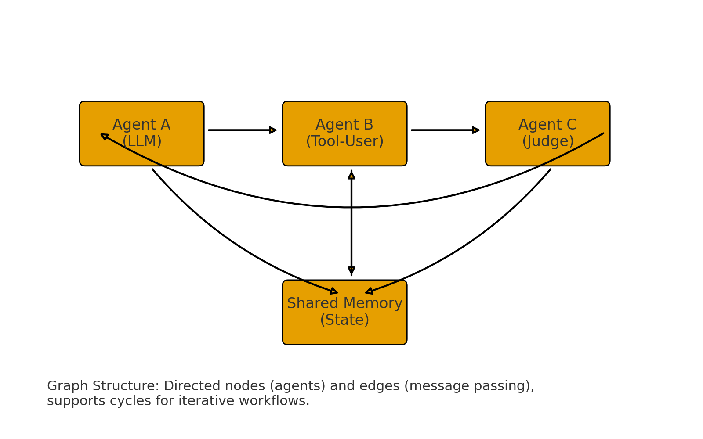
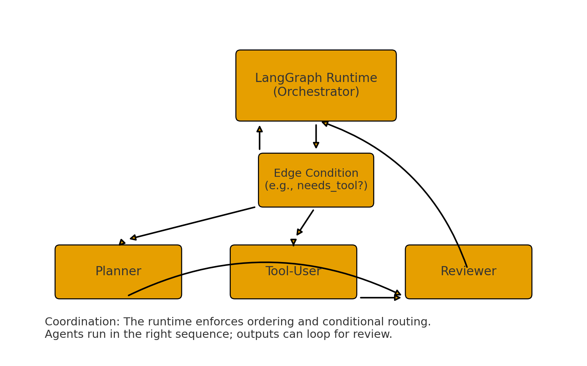

# LLM DEMO
## Concepts
### 3. What are some common pre-training objectives for LLMs, and how do they work?
#### 3.1  Masked Language Modeling (MLM)
- **Used in models like**: BERT, RoBERTa
- **How it works**:
    - Random tokens in a sentence are masked (replaced with `[MASK]`).
    - The model is trained to predict the masked word using both left and right context (i.e., it's **bidirectional**).
#### 3.2 Autoregressive Language Modeling (AR)
- **Used in models like**: GPT, GPT-2, GPT-3, GPT-4

### 4. 📌 Fine-Tuning
#### 4.1 What Is Fine-Tuning?
**Fine-tuning** is the process of taking a pre-trained language model (e.g., BERT, GPT, etc.) and training it further on **a smaller, domain-specific dataset** to adapt it to a specific task (like sentiment classification or question answering).
#### 🧠 4.2 Why Fine-Tuning Works
- When a model like DistilBERT is pre-trained:
    - It learns general knowledge of language patterns.
    - But it doesn’t know how to perform **task-specific** jobs like classifying IMDb reviews as positive or negative.

### 5. **How do you measure the performance of an LLM?**
#### 5.1 🔢 Perplexity
- **definition**:
Perplexity is a measurement of how well a language model predicts a sequence. It is the exponential of the average negative log-likelihood of the predicted tokens.
- **formula**:
Perplexity = *e*^Loss
- **interpretation**:

**Low perplexity** → Model is confident and accurate in predicting the next tokens.
**High perplexity** → Model is "surprised" by the actual tokens.
#### 5.2 🧮 Accuracy
- **definition**:
Accuracy is the ratio of **correct predictions to total predictions**. It is commonly used in classification tasks (e.g., sentiment analysis, text classification).
- **formula**:
Accuracy = Number of Correct Predictions / Total Predictions
#### 5.3 F1 Score
- **definition**:
F1 Score is the **harmonic mean** of Precision and Recall. It is especially useful for imbalanced datasets.

- **Precision** = How many of the predicted positives are correct?

- **Recall** = How many of the actual positives did the model catch?

- **formula**:
F1=(2*Precision*Recall)/(Precision+Recall)

#### 5.4

### 6. **Techniques for Controlling the Output of an LLM**
These methods let developers influence how a model responds, balancing between randomness, relevance, creativity, and determinism.
#### 6.1 🔥 Temperature
##### **What it does:** 
Controls the level of randomness in token selection.
##### **How it works:** 
During generation, the model uses probabilities to decide the next token. Temperature scales these probabilities:
- A **lower value** (e.g., 0.2) sharpens the distribution — the model is more confident and **chooses the most likely next word**, producing **deterministic and repetitive** outputs.
- A **higher value** (e.g., 1.0 or 1.5) flattens the distribution, allowing for more **diverse, creative, and unpredictable** text.

##### 🧊 Low Temperature (temperature=0.2)
- Explanation:
    - The output is **coherent**, **rhythmic**, and **safe**.
    - GPT-4 chooses tokens with the highest probability, so it sticks to standard poetic themes.
    - Less creative surprises, but more syntactically correct and “professional” sounding.

- ✅ Ideal for:
    - Factual tasks
    - Formal documentation
    - Summarization
    
#####  High Temperature (temperature=1.0)
- Explanation:
    - The output is **more imaginative and colorful**.
    - Words like "Emerald galaxies", "ink-black canvas" indicate a **creative leap**.

#### 6.2 🎯 Top-K Sampling
- **What it does**: Restricts the token selection pool to the **top K most probable tokens** at each generation step.
- **How it works**: If `top_k=50`, the model only chooses from the top 50 most likely next tokens rather than considering all options.


#### 6.3 Top-p Sampling
##### 🔍 What Is Top-P Sampling?
Top-P sampling chooses from the smallest set of tokens whose cumulative probability exceeds the threshold p. Lower values restrict choice to high-confidence tokens; higher values allow more diverse token selection.

##### Explanation in Example
- 0.3:
    - **Summary**: Output is short and nearly identical to 0.6; it stops mid-sentence.
    - **Behavior**: Most focused — selects tokens only from the top ~30% cumulative probability mass. Tends to be **highly relevant but less diverse**.
- 0.6:
    - **Summary**: Nearly identical to 0.3.
    - **Behavior**: Balanced — more flexible than 0.3 but still somewhat focused, but still constrained to safe outputs.
- 0.8 
    - **Summary**: Output starts to diversify — adds some background explanation.
### 7. 

### 8. How can you incorporate external knowledge into an LLM?
####  Knowledge Graph Integration (Simplified)
Use structured facts (triples or graphs `like France → Capital → Paris`) directly in the prompt. This adds factual grounding to help the model reason accurately.

#### RAG
##### **Retrieval-Augmented Generation (RAG)** is a hybrid approach that:

1. Retrieves relevant documents from a large external knowledge base or corpus (like Wikipedia, PDFs, or internal files),

2. Augments the prompt by inserting the retrieved text,

3. Generates the answer using a generative language model (like GPT, BART, or T5).

##### 🧠 How it works (step-by-step):
1. User inputs a query
    - → e.g., “What are the benefits of vitamin D?”
2. 


### 9. LangChain
#### What is LangChain?
LangChain is an open-source framework that helps developers build applications powered by Large Language Models (LLMs).
Instead of coding every piece manually, LangChain provides ready-made tools, components, and APIs to:

- Connect to language models
- Manage prompts and conversations

- Link external resources (databases, APIs, files, search engines, etc.)

- Build complex workflows by chaining multiple steps together

This makes it easier to move from “just calling an LLM” to building full, production-ready AI apps.

#### ⚙️ Key Capabilities
1. **Tailorable Prompts**:
- You can design prompts dynamically.

- Example: A customer support app could insert the customer’s name, order details, and conversation history into a template before sending it to the LLM.

2. **Chain Link Components**:
- LangChain allows you to connect different steps into a **chain**.
- Example: First step → clean user input → second step → query a database → third step → summarize result.
- This chaining is why it’s called LangChain.

3. **Integration with External Models and Tools**:
- It’s not limited to one LLM (like GPT).

4. **Versatile, Mix-and-Match Components**:
5. **Context Management**:

#### 💡 Why it Matters
- You need **more than just a single LLM call** (e.g., multi-step reasoning, API calls, retrieval from databases).
- You want to integrate AI into real-world applications like chatbots, knowledge bases, assistants, or data pipelines.
- You’re building something **scalable and reusable** instead of quick one-off scripts.
#### 🛠️ Example Applications
- **Chatbots** (customer service, Q&A)
- **Virtual Assistants** (personalized scheduling, task management)
- **Language Tools** (translation, summarization, rewriting)
- Data Apps (RAG systems where the LLM retrieves info from your database or documents)
- Sentiment/Analytics (combining LLM reasoning with ML models and dashboards)

#### Key Components of LangChain
##### components & chains
- **definition**: “components” are small, focused pieces (models, prompts, retrievers, parsers). a chain wires them together so the output of one becomes the input of the next.
- **when to use**: any multi-step flow (clean → prompt → LLM → parse → store).
- **example**:
```python
from langchain_openai import ChatOpenAI
from langchain_core.prompts import ChatPromptTemplate

llm = ChatOpenAI(model="gpt-4o-mini")
prompt = ChatPromptTemplate.from_messages([
    ("system", "You are a concise assistant."),
    ("human", "Summarize:\n{text}")
])

chain = prompt | llm  # pipe operator builds a chain

chain.invoke({"text": "LangChain lets you mix & match components to build LLM apps."})

```


##### prompt templates
- **definition**: reusable, parameterized prompts that turn variables into well-structured messages (great for consistency and guardrails).
- **when to use**: you need dynamic content (user name, retrieved docs, tone, format).
- **example**:
```python
from langchain_core.prompts import ChatPromptTemplate

prompt = ChatPromptTemplate.from_messages([
    ("system", "Act as a {role}. Keep answers under {limit} words."),
    ("human", "{question}")
])

msg = prompt.format_messages(role="math tutor", limit="60", question="Explain eigenvalues.")

```

##### vector stores
- **definition**: databases that store **embeddings** (numeric vectors) for semantic search (RAG).
- **when to use**: you want the model to answer using your data (docs, tickets, wikis).
- **example**:
```python
from langchain_openai import OpenAIEmbeddings
from langchain_chroma import Chroma

emb = OpenAIEmbeddings(model="text-embedding-3-small")
vectordb = Chroma(collection_name="docs", embedding_function=emb)

# add texts
ids = vectordb.add_texts(["LangChain composes LLM apps.", "RAG adds private knowledge."])
# similarity search
docs = vectordb.similarity_search("How do I add my own data?", k=1)

```
##### example selectors
- **definition**: automatically choose few-shot examples most similar/relevant to the user’s input (boosts accuracy).
- **when to use**:tasks benefit from demonstrations (classification, style transfer, extraction).
- 
##### agents
- **definition**: runtime systems that let LLMs **use tools** (web search, code, DB) and decide which tool to call next (e.g., ReAct-style reasoning). modern LangChain pairs agents with **LangGraph** for reliability, but you can still run simple tool-using chains in pure LangChain.
- **when to use**: multi-step tasks with external actions (search → fetch → compute → answer).
- **example**:
```python
from langchain_openai import ChatOpenAI
from langchain_core.tools import tool
from langchain_core.prompts import ChatPromptTemplate

@tool
def add(a: int, b: int) -> int:
    "Add two integers."
    return a + b

llm = ChatOpenAI(model="gpt-4o-mini")
prompt = ChatPromptTemplate.from_messages([
    ("system", "You can use tools when needed. Think step-by-step."),
    ("human", "{question}")
])

# Tool-calling chain (the LLM can decide to call `add`)
chain = prompt | llm.bind_tools([add])

result = chain.invoke({"question": "What is 123 + 456?"})
# If the model calls the tool, LangChain will route, execute it, and return a final answer.

```


### 10. Langgraph

#### Key Components
1. **Graph Structure**:

Think of your application as a directed graph:
- **Nodes** = **agents** (LLMs, tools, human input nodes, evaluators, etc.).
- **Edges** = **communication channels** (the path data or decisions take from one agent to another).
This setup lets you::
- Chain together specialized agents (e.g., one generates answers, another checks correctness).
- Introduce **cycles** for iterative refinement, such as a loop between a generator and a reviewer until quality criteria are met.
- Visualize workflows in a modular way, like a flowchart for AI reasoning.

2. **State Managemet**:

- A big challenge in multi-agent systems is keeping track of context across steps. LangGraph solves this with **automatic state management**:
- The **state** contains accumulated messages, facts, or metadata.
- Every time an agent acts, the state is updated — ensuring no history is lost.
- The state can be checkpointed (saved at points in the graph) and even resumed later, which makes long-running or interruptible workflows reliable.

3. **Coordination**:

- LangGraph ensures that agents run in the **right order**.
- It handles **conditional routing**, meaning an agent’s output can decide which path to follow (e.g., “If tool needed → Tool Agent, else → Planner”).
- Coordination guarantees that information exchange is seamless (no dropped messages, no out-of-sync agents).

#### Graph Fundamentals
1. **State**:
- **definition**: a shared, evolving memory object that flows through your graph. Every node reads the current state and returns an **updated** state. LangGraph manages persistence/checkpoints so you can resume runs, branch, and inspect history.
- **Typical contents**:
    - `messages`: conversation history (`HumanMessage`, `AIMessage`, etc.)
    - working variables: parsed fields, IDs, partial results
    - control flags: scores, decisions, error info
- **example**:
```python
from typing import TypedDict, List, Optional
from langchain_core.messages import BaseMessage

class State(TypedDict):
    messages: List[BaseMessage]
    facts: dict
    decision: Optional[str]
```

2. **Edges & Conditional Edges**:
- **Edges** connect nodes and define execution order.
- **Conditional edges** are dynamic branches chosen at runtime from the current state.
- **Cycles** allow iterative refinement (e.g., generate → critique → revise).
- **example**:
```python
from langgraph.graph import StateGraph, END

g = StateGraph(State)
g.add_node("extract", extract_node)
g.add_node("review", review_node)
g.add_node("revise", revise_node)

def route_after_review(state: State) -> str:
    return "revise" if state["decision"] == "needs_changes" else "end"

g.set_entry_point("extract")
g.add_edge("extract", "review")
g.add_conditional_edges("review", route_after_review, {"revise": "revise", "end": END})
g.add_edge("revise", "review")  # cycle until passes review

```
3. **Tool & ToolNode**:
- Tool = any external operation: web/API call, DB query, calculator, custom Python.
4. **Message Types (LangChain / LangGraph)**:
Messages are structured data units that travel in `state["messages"]`. They capture roles and special behaviors.
- `HumanMessage` – user input (“What’s the weather in Paris?”).
- `AIMessage` – LLM output (text and/or tool call instructions).
- `SystemMessage` – instructions or policy that steer the LLM (“You are a helpful assistant…”).
- `ToolMessage` – the result of executing a tool, sent back to the LLM to continue reasoning.
- `RemoveMessage` – instructs the runtime/memory to drop prior messages (useful for context pruning/privacy).

#### Why Langgraph
1. **Simplified development**
- **What it means**: You describe what should happen (nodes + edges), and LangGraph handles how to run it (order, passing messages, resuming, retries).
- **Why it’s simpler than hand-rolled logic**:

2. **Flexibility**
- **What it means**: You can compose any kind of node and route between them however you like.
- **Ways flexibility shows up**:
    - **Heterogeneous nodes**: LLM agents, tools, evaluators, vector lookups, humans (approval steps), webhooks, your own Python.
3. **Scalability**:
- **What it means**: The runtime is built to handle lots of concurrent, long-running, or complex workflows.
- How you scale in practice:
    - Checkpointing to durable storage: Swap `MemorySaver` for Redis/Postgres-backed checkpointers so any worker can resume a session by thread_id.
    - Horizontal workers: Run multiple stateless worker processes/containers pointing at the same checkpointer. Each takes a turn advancing a graph.
4. **Fault tolerance**:
- **definition**: When something fails, you don’t lose the whole run—and you can intentionally handle failures.
- **Mechanisms & patterns**:
    - **Per-node checkpoints**: On crash/restart, resume from the last finished node with the saved state.

#### Graph Construction
1. **Using the `StateGraph` class**
- LangGraph provides the `StateGraph` class as a base for building graphs.
- We begin by initializing a `StateGraph` using the previously defined State class. This ensures that all nodes
2. **Adding Nodes and Edges**
- Next, we add **nodes** (functional units) and **edges** (connections that determine flow).
- Each node can represent an LLM call, an API call, or a custom function. Edges define how data flows between these nodes.
